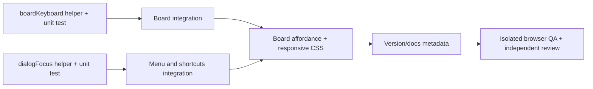

# Project Board v0.9 Accessibility & Mobile Field-Use Implementation Plan

> **For agentic workers:** REQUIRED SUB-SKILL: Use superpowers:subagent-driven-development (recommended) or superpowers:executing-plans to implement this plan task-by-task. Steps use checkbox (`- [ ]`) syntax for tracking.

**Goal:** Harden Project Board for mobile field use and modal keyboard accessibility while preserving its local-first data model, intentional narrow Board scroll, and desktop behavior.

**Architecture:** Extract only two DOM-agnostic decision seams: Board keyboard action resolution and modal-focus decisions. React components retain ownership of rendering, state, refs, routing, persistence, and user-visible announcements; they consume the helpers rather than duplicating branching logic. Board overflow remains component-local and is observed from the existing `.board-scroll` container.

**Tech Stack:** React 19, TypeScript 6, `react-router` 8.3.0, Vite 8, native `node:test`, oxlint, agent-browser/Chrome for isolated browser QA.

## Global Constraints

- No runtime or development dependency may be added, removed, or upgraded.
- Do not change `project-board-v1`, `project-board-activity-v1`, filter, theme, or any other storage key/schema.
- No backend, telemetry, cloud sync, data migration, or GitHub Pages strategy change.
- Preserve desktop Board layout and its intentional internal horizontal scroll behavior.
- The narrow breakpoint is exactly `max-width: 767px`; desktop verification is `1440x900`.
- The affordance is static text, never an `aria-live` region, never focusable, and cannot intercept pointer input.
- Test state is isolated and discarded after QA; never read, import, overwrite, or persist a real user's browser data.
- All code is drafted through OpenCode `abel-claude/kr/claude-opus-5` with explicit `--title`; Hermes independently reviews and verifies each task.
- Do not push, deploy, alter GitHub settings, or restart services under this plan.

---

## Dependency graph



## File responsibility map

| File | Responsibility after v0.9 |
| --- | --- |
| `src/lib/boardKeyboard.ts` | Pure keyboard action and announcement decisions for Board cards. |
| `src/lib/boardKeyboard.test.ts` | Native Node regression coverage for keyboard action branches. |
| `src/lib/dialogFocus.ts` | Pure modal focus target/wrap/restore decisions with structural focusable types. |
| `src/lib/dialogFocus.test.ts` | Native Node regression coverage for modal focus decisions. |
| `src/hooks/useDialogFocus.ts` | Single React focus-lifecycle primitive shared by the menu and shortcut dialog. |
| `src/pages/Board.tsx` | Consumes keyboard helper; owns scroll overflow state, hint dismissal, Board copy, and ref. |
| `src/components/Layout.tsx` | Wires shared focus lifecycle to the mobile menu. |
| `src/components/KeyboardShortcuts.tsx` | Wires shared focus lifecycle to the help dialog. |
| `src/index.css` | Narrow-only Board hint/compact sizing and existing modal focus styling. |
| `package.json`, `package-lock.json`, `src/version.ts` | Synchronized `0.9.0` metadata without dependency changes. |
| `CHANGELOG.md`, `README.md`, `docs/PROJECT_BOARD_FEATURE_SPEC.md` | v0.9 capability and QA documentation. |

## Task 1: Extract Board keyboard decisions

**Files:**
- Create: `src/lib/boardKeyboard.ts`
- Create: `src/lib/boardKeyboard.test.ts`
- Modify: `src/pages/Board.tsx:1-151`

**Interfaces:**

```ts
export type BoardKeyboardAction =
  | { kind: 'move-status'; status: ProjectStatus; message: string }
  | { kind: 'move-focus'; projectId: string }
  | { kind: 'open-detail'; projectId: string }
  | { kind: 'none' };

export function resolveBoardKeyboardAction(input: {
  key: string;
  projectId: string;
  status: ProjectStatus;
  statuses: readonly ProjectStatus[];
  columnProjectIds: readonly string[];
}): BoardKeyboardAction;
```

- Consumes: `ProjectStatus` and `STATUS_LABELS` from `src/types.ts`.
- Produces: a deterministic action for `Board.handleCardKeyDown`; the component still calls `preventDefault`, `stopPropagation`, `updateProject`, `focusCard`, and `navigate`.

- [ ] **Step 1: Write failing native unit tests.** Create `src/lib/boardKeyboard.test.ts` using `node:assert/strict` and `node:test`. Cover every supported key family and boundaries:

```ts
assert.deepEqual(resolveBoardKeyboardAction({
  key: 'ArrowRight', projectId: 'p1', status: 'idea',
  statuses: ACTIVE_STATUSES, columnProjectIds: ['p1', 'p2'],
}), { kind: 'move-status', status: 'planned', message: 'Moved to Planned' });
assert.deepEqual(/* h at first status */, { kind: 'none' });
assert.deepEqual(/* j for p1 */, { kind: 'move-focus', projectId: 'p2' });
assert.deepEqual(/* k at first card */, { kind: 'none' });
assert.deepEqual(/* Enter */, { kind: 'open-detail', projectId: 'p1' });
assert.deepEqual(/* Space */, { kind: 'open-detail', projectId: 'p1' });
assert.deepEqual(/* x */, { kind: 'none' });
```

- [ ] **Step 2: Confirm RED.** Run:

```bash
node --import ./scripts/test-resolve-hook.mjs --test src/lib/boardKeyboard.test.ts
```

Expected: FAIL with `ERR_MODULE_NOT_FOUND` for `./boardKeyboard`.

- [ ] **Step 3: Implement minimal pure resolver.** Create `src/lib/boardKeyboard.ts`. Normalize only the key comparisons already accepted by Board (`ArrowLeft`/`ArrowRight`/`h`/`H`/`l`/`L`, `ArrowUp`/`ArrowDown`/`j`/`J`/`k`/`K`, `Enter`, and `' '`). Return `none` at boundaries. For a status move use exactly:

```ts
{ kind: 'move-status', status: nextStatus,
  message: `Moved to ${STATUS_LABELS[nextStatus]}` }
```

- [ ] **Step 4: Integrate without behavior drift.** In `src/pages/Board.tsx`, replace the inline branch tree after the existing typing-target guard with `resolveBoardKeyboardAction`. For non-`none`, retain the current `preventDefault()` and `stopPropagation()` calls. Map actions exactly:

```ts
if (action.kind === 'move-status') {
  updateProject(projectId, { status: action.status });
  setLiveMessage(action.message);
  setFocusedId(projectId);
  requestAnimationFrame(() => requestAnimationFrame(() => {
    cardEls.current.get(projectId)?.focus();
  }));
}
if (action.kind === 'move-focus') focusCard(action.projectId);
if (action.kind === 'open-detail') navigate(`/project/${projectId}`);
```

- [ ] **Step 5: Confirm GREEN and type safety.** Run:

```bash
npm test && npm run build
```

Expected: all tests pass, TypeScript build exits `0`.

- [ ] **Step 6: Commit the vertical slice.**

```bash
git add src/lib/boardKeyboard.ts src/lib/boardKeyboard.test.ts src/pages/Board.tsx
git commit -m "test: cover Board keyboard decisions"
```

### Checkpoint 1

- [ ] `npm test` passes with new Board key coverage.
- [ ] `npm run build` passes.
- [ ] Arrow/hjkl, Enter/Space, live message, and post-move focus code paths remain present in Board.

## Task 2: Build the dependency-free modal focus primitive

**Files:**
- Create: `src/lib/dialogFocus.ts`
- Create: `src/lib/dialogFocus.test.ts`
- Create: `src/hooks/useDialogFocus.ts`

**Interfaces:**

```ts
export type FocusableTarget = { focus: () => void };
export function initialFocusTarget(
  preferred: FocusableTarget | null,
  focusables: readonly FocusableTarget[],
  fallback: FocusableTarget,
): FocusableTarget;
export function wrappedFocusTarget(input: {
  focusables: readonly FocusableTarget[];
  active: FocusableTarget | null;
  shiftKey: boolean;
}): FocusableTarget | null;
export function restoreFocus(target: FocusableTarget | null): void;

export function useDialogFocus(options: {
  open: boolean;
  containerRef: React.RefObject<HTMLElement | null>;
  initialFocusRef?: React.RefObject<HTMLElement | null>;
  triggerRef?: React.RefObject<HTMLElement | null>;
  onRequestClose: () => void;
}): void;
```

- Consumes: DOM refs supplied by the consumer; no store, route, or storage state.
- Produces: one shared lifecycle: capture opener, initial focus, Escape close, Tab containment, and return focus.

- [ ] **Step 1: Write failing structural unit tests.** Use simple objects with a counted `focus()` method; do not require jsdom. Assert preferred-first selection, first/last fallback, forward Tab wrapping from last, reverse Tab wrapping from first, `null` for non-edge Tab, and `restoreFocus(null)` no-op.

```ts
const first = fakeFocusable(); const last = fakeFocusable();
assert.equal(wrappedFocusTarget({ focusables: [first, last], active: last, shiftKey: false }), first);
assert.equal(wrappedFocusTarget({ focusables: [first, last], active: first, shiftKey: true }), last);
restoreFocus(first); assert.equal(first.calls, 1);
```

- [ ] **Step 2: Confirm RED.** Run:

```bash
node --import ./scripts/test-resolve-hook.mjs --test src/lib/dialogFocus.test.ts
```

Expected: FAIL because `dialogFocus.ts` does not exist.

- [ ] **Step 3: Implement pure focus decisions.** `dialogFocus.ts` must not import React or access `document`. `wrappedFocusTarget` returns a target only at a wrap boundary; it never moves focus itself. `restoreFocus` calls `.focus()` only for a non-null target.

- [ ] **Step 4: Implement the sole React lifecycle primitive.** `useDialogFocus.ts` imports the pure helpers and defines the focusable selector once. On `open` transition it captures `triggerRef.current ?? document.activeElement`, then focuses `initialFocusRef.current`, otherwise the first focusable child, otherwise the container (which must receive `tabIndex={-1}`). While open, a window `keydown` listener handles `Escape` by `preventDefault()` plus `onRequestClose()`, and calls `wrappedFocusTarget` for Tab edge wrapping. On the closing transition, call `restoreFocus` via `requestAnimationFrame`; cleanup listeners on close/unmount. Do not set `inert` globally or mutate application storage.

- [ ] **Step 5: Confirm GREEN.** Run:

```bash
npm test && npm run build && npm run lint
```

Expected: tests/build pass; lint has no new errors (the pre-existing `ProjectContext` fast-refresh warning may remain).

- [ ] **Step 6: Commit the primitive.**

```bash
git add src/lib/dialogFocus.ts src/lib/dialogFocus.test.ts src/hooks/useDialogFocus.ts
git commit -m "feat: add reusable dialog focus lifecycle"
```

## Task 3: Apply the shared modal lifecycle to existing UI

**Files:**
- Modify: `src/components/Layout.tsx:1-170`
- Modify: `src/components/KeyboardShortcuts.tsx:1-131`
- Modify: `src/index.css:1951-2015,2147-2216`

**Interfaces:**
- Consumes: `useDialogFocus` from Task 2.
- Produces: focus-correct menu sheet and shortcut dialog, with no duplicate Escape/Tab code.

- [ ] **Step 1: Write the integration acceptance checklist before edits.** Record these exact browser assertions in the task notes: opening menu focuses `closeBtnRef`; Escape/backdrop/action close returns focus to `menuBtnRef`; `?` captures current focused element and closing restores it; Tab/Shift+Tab cannot leave either open surface.

- [ ] **Step 2: Confirm the current gap manually in an isolated browser session.** At 390x844, open the menu, press Tab repeatedly, press Escape, and record that focus return/containment is not yet guaranteed. Do not use existing user profile data.

- [ ] **Step 3: Integrate minimally.** In `Layout.tsx`, keep `menuBtnRef` and `closeBtnRef`, add `menuSheetRef`, and invoke `useDialogFocus({ open: menuOpen, containerRef: menuSheetRef, initialFocusRef: closeBtnRef, triggerRef: menuBtnRef, onRequestClose: () => setMenuOpen(false) })`. Remove the component-local window Escape effect. Keep `aria-expanded`, `aria-controls`, `role="dialog"`, `aria-modal="true"`, and backdrop close.

In `KeyboardShortcuts.tsx`, add `panelRef` and `closeButtonRef`; invoke the same hook with `triggerRef` omitted so the hook captures the active opener when `?` is pressed. Remove only duplicate Escape handling from the global shortcut listener; preserve `?` as a close shortcut while help is open. Apply `ref={panelRef}` and `tabIndex={-1}` to the panel and `ref={closeButtonRef}` to its close button.

- [ ] **Step 4: Make focus visible without redesign.** Add only selector-scoped focus-visible rules if existing global button focus styling is insufficient:

```css
.menu-sheet:focus-visible,
.shortcut-panel:focus-visible { outline: 2px solid var(--primary); outline-offset: -2px; }
```

Do not change modal dimensions, colors, or z-index ordering.

- [ ] **Step 5: Verify integration.** Run:

```bash
npm test && npm run lint && npm run build
```

Expected: pass; no source files outside the three listed UI files changed.

- [ ] **Step 6: Commit.**

```bash
git add src/components/Layout.tsx src/components/KeyboardShortcuts.tsx src/index.css
git commit -m "fix: contain focus in mobile menu and shortcuts"
```

### Checkpoint 2

- [ ] No component contains a second custom modal focus-trap implementation.
- [ ] Menu and shortcut dialog both use `useDialogFocus`.
- [ ] `npm test`, `npm run lint`, and `npm run build` pass.

## Task 4: Add narrow Board scroll affordance and compact empty state

**Files:**
- Create: `src/lib/boardScrollHint.ts`
- Create: `src/lib/boardScrollHint.test.ts`
- Modify: `src/pages/Board.tsx:1-220`
- Modify: `src/index.css:1368-1396,1562-1564,1845-2058`

**Interfaces:**

```ts
export function shouldShowBoardScrollHint(input: {
  narrow: boolean;
  scrollWidth: number;
  clientWidth: number;
  dismissed: boolean;
}): boolean;
```

- Consumes: scalar layout measurements only.
- Produces: whether Board renders its static, non-focusable hint.

- [ ] **Step 1: Write failing hint tests.** Assert true only for `narrow: true`, `scrollWidth > clientWidth`, and `dismissed: false`; assert false for equal widths, wide screen, or dismissed state.

- [ ] **Step 2: Confirm RED.** Run:

```bash
node --import ./scripts/test-resolve-hook.mjs --test src/lib/boardScrollHint.test.ts
```

Expected: FAIL because `boardScrollHint.ts` is absent.

- [ ] **Step 3: Add the pure gate and Board state.** In `Board.tsx`, add `boardScrollRef`, `isNarrow`, `hasOverflow`, and in-memory `scrollHintDismissed` state. Use `(max-width: 767px)` `matchMedia` with a listener cleanup. Measure `scrollWidth > clientWidth` after render, on resize, and via `ResizeObserver` when available; when unavailable, retain the window resize measurement. Disconnect observers and remove listeners in cleanup. Never write the dismissal to storage.

- [ ] **Step 4: Render accurate copy.** Replace the current subtitle with concise wording that says desktop users may drag, keyboard users use arrow/hjkl, and mobile users can open a project detail to edit status. Render a static element adjacent to `.board-scroll` only when `shouldShowBoardScrollHint(...)` is true:

```tsx
<p className="board-scroll-hint" aria-hidden="false">
  Swipe sideways to view more statuses.
</p>
```

Attach `onScroll={() => setScrollHintDismissed(true)}` to `.board-scroll`. The hint has no button role, no tab index, no `aria-live`, and no pointer-event overlay.

- [ ] **Step 5: Add narrow-only CSS.** Keep desktop untouched. Under existing `@media (max-width: 767px)`, add compact Board values only when `.board-page.board-page-empty` is present: reduce `.board-columns` minimum height from the desktop `min(70vh, 640px)` to a documented compact height, reduce `.board-column` min-height proportionally, and preserve the `Create one` link above fold. Style `.board-scroll-hint` as static muted text with `pointer-events: none`; hide it outside the media query. Add `board-page-empty` to Board only when `projects.length === 0`.

- [ ] **Step 6: Confirm GREEN.** Run:

```bash
npm test && npm run lint && npm run build && npm run build:pages
```

Expected: all commands exit `0`; Pages output retains `dist/index.html`, `dist/404.html`, and `dist/.nojekyll`.

- [ ] **Step 7: Commit.**

```bash
git add src/lib/boardScrollHint.ts src/lib/boardScrollHint.test.ts src/pages/Board.tsx src/index.css
git commit -m "feat: improve mobile Board field use"
```

## Task 5: Synchronize v0.9.0 metadata and documentation

**Files:**
- Modify: `package.json`
- Modify: `package-lock.json`
- Modify: `src/version.ts`
- Modify: `CHANGELOG.md`
- Modify: `README.md`
- Modify: `docs/PROJECT_BOARD_FEATURE_SPEC.md`

- [ ] **Step 1: Add failing version-consistency assertions.** Extend `src/lib/dependencies.test.ts` so it reads `package.json` and asserts its version equals `APP_VERSION`; add a direct JSON assertion that root lockfile version and `packages[''].version` equal `package.json` version. Import only JSON/constant already available to native Node tests.

- [ ] **Step 2: Confirm RED.** Run:

```bash
node --import ./scripts/test-resolve-hook.mjs --test src/lib/dependencies.test.ts
```

Expected: FAIL because package is `0.8.2` while lock root metadata is `0.8.1`.

- [ ] **Step 3: Apply metadata-only version reconciliation.** Set package, lockfile root, `packages['']`, and `APP_VERSION` to `0.9.0`. Generate lockfile metadata with:

```bash
npm install --package-lock-only --ignore-scripts
```

Then verify dependency names and resolved versions did not change with `git diff -- package.json package-lock.json`; only root-version metadata is allowed.

- [ ] **Step 4: Update human-facing docs.** Add a dated `0.9.0` changelog entry naming mobile Board affordance, focus lifecycle, keyboard regressions, and browser QA. Update README version and current release summary. Add a v0.9 feature inventory section/checklist to `docs/PROJECT_BOARD_FEATURE_SPEC.md`. Do not alter the already-approved design spec's accepted scope.

- [ ] **Step 5: Confirm GREEN.** Run:

```bash
npm test && npm run lint && npm run build && npm run build:pages
git diff --check
npm audit --omit=dev --audit-level=high
```

Expected: tests/builds pass, diff check is empty, and production audit reports no high/critical vulnerability.

- [ ] **Step 6: Commit.**

```bash
git add package.json package-lock.json src/version.ts src/lib/dependencies.test.ts CHANGELOG.md README.md docs/PROJECT_BOARD_FEATURE_SPEC.md docs/superpowers/specs/2026-07-31-project-board-v09-accessibility-mobile-design.md
git commit -m "docs: release v0.9 accessibility hardening"
```

## Task 6: Independent review and isolated browser release gate

**Files:**
- No source changes unless a reviewer identifies a scoped defect.
- Evidence files: `/tmp/project-board-v09-*.png`, `/tmp/project-board-v09-*.json`, and `/tmp/project-board-v09-*.txt` only; never commit them.

- [ ] **Step 1: Run an independent diff review.** Ask a fresh reviewer to inspect only `HEAD~4..HEAD` (or the task commits actually produced) for accessibility, storage, responsive, security, and regression issues. Resolve every Required finding with a new focused test/fix commit; do not waive findings silently.

- [ ] **Step 2: Build a local Pages preview.**

```bash
npm run build:pages
npm run preview -- --host 127.0.0.1 --port 8780
```

Expected: preview listens locally. Keep the process tracked; close it after QA.

- [ ] **Step 3: Populate only isolated browser state through the UI.** Open the local preview in an agent-browser session/profile, navigate to `/project-board/settings`, activate **Load realistic inventory (merge)**, then verify the success message. Do not touch the production site or any existing browser profile. Close the session at completion.

- [ ] **Step 4: Execute the viewport matrix.** At `390x844`, `360x800`, and `1440x900`, capture populated Board, empty Board (in a fresh isolated session), open mobile menu, and open shortcut dialog. For each required state collect screenshot, Axe result, `document.documentElement.scrollWidth/clientWidth`, console, and errors. Acceptance is:
  - Axe violations: `0` for empty/populated Board, menu, and shortcut dialog.
  - Root overflow: `scrollWidth === clientWidth` at every viewport.
  - Narrow: Board horizontally scrolls; hint is visible before horizontal scroll and absent/de-emphasized after it; empty Board `Create one` is above fold.
  - Desktop: no hint; Board/layout unchanged.
  - Menu/dialog: initial focus, Tab/Shift+Tab containment, Escape close, and focus return pass.
  - Board: Arrow/hjkl status and focus movement, Enter/Space detail navigation, live announcement, and post-move focus pass.
  - Console: no errors and no new warnings attributable to v0.9.

- [ ] **Step 5: Run final repository gates.**

```bash
npm test
npm run lint
npm run build
npm run build:pages
npm audit --omit=dev --audit-level=high
git diff --check
git status --short
```

Expected: all commands pass; only intended tracked source/docs are in commits; worktree is clean.

- [ ] **Step 6: Record evidence and ask Abel before release.** Report exact test counts, lint warnings, build/audit output, reviewer result, screenshot paths, and the commit range. Do not push to `main` or publish `gh-pages` until Abel explicitly approves release.

## Final release gate

- [ ] A1–A14 automated criteria are covered by the new pure-helper tests and pass under `npm test`.
- [ ] B1–B11 browser criteria pass in isolated state across all three viewport sizes.
- [ ] No user data, storage schema/key, dependency version, deployment setting, or secret changed.
- [ ] Independent review has no unresolved Required/Critical finding.
- [ ] Abel separately authorizes push and GitHub Pages deployment.
