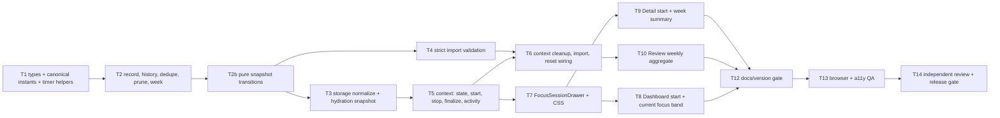

# Implementation Plan — Project Board v0.11 "Focus Session"

Date: 2026-08-03 (revised after independent review — final round: active-step
invariant after every mutation, `elapsedSeconds` semantics on import, one stop
clamp formula)
Spec: `docs/superpowers/specs/2026-08-03-project-board-focus-session.md` (approved)
Design reference: `docs/superpowers/specs/2026-08-02-project-board-quiet-command-center-design.md`
Worktree: `.worktrees/project-board-focus-session`

> **For agentic workers:** implement task-by-task, in order. Steps use checkbox
> (`- [ ]`) syntax for tracking. Every task is a vertical slice that ends GREEN
> (tests + build) and gets its own commit. Do not start a task before its
> upstream task's checkpoint passes.

**Goal:** add a local-first Focus Session (start → persist → restore → explicitly
resolve → summarize → back up) implementing the approved spec exactly, without
touching dependencies, storage keys, routes, shortcuts, or any v0.9/v0.10
behavioral contract.

**Architecture:** Focus **invariants** live in one pure module
(`src/lib/focusSession.ts`): time math, record/history rules, prune, weekly
aggregation, canonical-timestamp checks, and **snapshot transitions**. Display
formatting (MM:SS text, band label, announcement sentences, outcome labels) lives
with the UI that renders it (Task 7/8/9) so the domain module stays small and
invariant-bearing instead of becoming a god module. `ProjectContext` is the only
mutation boundary and the only writer of `localStorage`. React components own
ephemeral UI state (drawer open, selected preset, note draft, the 1 Hz redraw
tick) and never persist. Timer truth is absolute ISO instants (`startedAt`,
`endsAt`, and `stoppedAt` once Stop is pressed); nothing per-second is written.

**Purity rule (hard):** no React state updater (`setProjects(prev => …)`,
`setFocus(prev => …)`, `setActivity(prev => …)`) may contain a side effect,
a `toggleStep` call, a `pushActivity`/`saveActivity` call, storage I/O, or any
other observable action. Every Focus mutation is: (1) compute a pure transition
from a local snapshot, (2) validate it, (3) apply plain values with setters,
(4) persist and append activity exactly once, outside every updater.

**Tech stack (unchanged):** React 19.2, TypeScript ~6.0, `react-router` 8.3.0,
Vite 8, native `node:test`, oxlint. No new dependency, no new devDependency, no
lockfile dependency change.

---

## 0. How to read this plan

Each task has:

- **Files** — exact create/modify paths.
- **Interfaces** — the exact exported signatures the task must land.
- **Steps** — test-first: write failing test → confirm RED → implement → confirm
  GREEN → commit.
- **Acceptance criteria** — behavioral, observable, and checkable.
- **Checkpoint** — must pass before the next task starts.

Task numbering is stable: the optional import-preview task that used to sit at
**Task 11 has been removed from scope entirely**, and the numbers 12/13/14 are
kept as-is so the documentation/version gate stays **Task 12**. There is no
Task 11.

### 0.1 Fixed commands

```bash
TEST:    npm test
ONE:     node --import ./scripts/test-resolve-hook.mjs --test src/lib/<file>.test.ts
LINT:    npm run lint
BUILD:   npm run build
PAGES:   npm run build:pages
PREVIEW: npm run preview -- --host 127.0.0.1 --port 8780
DIFF:    git diff --check
DEPS:    git diff --stat package-lock.json     # must stay empty
```

### 0.2 Baseline facts (verified by reading this worktree)

- `package.json` version `0.10.0`; `src/version.ts` `APP_VERSION = '0.10.0'`;
  `CHANGELOG.md` newest entry is `0.9.0` (no `0.10.0` entry yet).
- Test runner is Node's built-in runner over `src/**/*.test.ts` only.
  `scripts/test-resolve-hook.mjs` resolves extensionless relative imports to
  `.ts` **only** — `.tsx` is not resolvable, and `tsconfig.test.json` includes
  `src/**/*.test.ts` with no DOM test library. **Therefore no component-level
  test is possible; every decision that carries an invariant must be a pure
  `.ts` function.**
- `tsconfig.app.json` excludes `src/**/*.test.ts`, so new test files stay out of
  the app build automatically.
- Existing test files: `src/lib/export.test.ts`, `dialogFocus.test.ts`,
  `boardKeyboard.test.ts`, `boardScrollHint.test.ts`, `dependencies.test.ts`.
  The v0.10 lane measured 99 passing cases and exactly 1 pre-existing oxlint
  warning located in `src/store/ProjectContext.tsx`.
- `src/main.tsx` renders inside `<StrictMode>`: development double-invokes
  effects and state updaters. Because updaters are pure value maps under this
  plan, double invocation is harmless; finalize idempotence comes from the
  eagerly advanced snapshot ref (D-3).
- `ProjectContext` today: `nowIso()` is `new Date().toISOString()` (millisecond
  precision, `Z` suffix); `projectsRef.current = projects` is assigned during
  render; hydration effect sets `projects` from `loadStorage()`; one persistence
  effect (`[projects, settings, ready]`) is the only `saveStorage` call site;
  `pushActivity` currently calls `saveActivity` inside its `setActivity` updater.
  **That pre-existing call is out of scope and stays untouched**; new Focus code
  must not add another nested-side-effect updater and instead uses the additive
  snapshot-based `appendActivityEvents` helper from Task 5.
- `loadStorage()` is lenient (returns `null` and never throws);
  `validateImportBlob()` is strict (throws `ImportValidationError` with
  user-safe text). Both behaviors must be preserved and extended in kind (D-2).
- `importValidation.ts` already exports `isValidCalendarDateString` and a
  `requireIsoDate` helper used for `deadline` / `started_at`; Focus needs a
  stricter canonical-instant check (D-14) and must not weaken the existing one.
- `Activity.tsx` holds `const TYPE_LABELS: Record<ActivityType, string>` — adding
  a new `ActivityType` member is compiler-enforced there. `RecentActivity.tsx`
  and `Activity.tsx` both derive a CSS class from `activity-type-${e.type}`, and
  unstyled types fall back to the neutral `.activity-type` chip.
- Existing unrelated "focus" names that must not be disturbed:
  `src/lib/focus.ts` (`matchesFocusThisWeek`), the Dashboard **Focus this week**
  filter chip, the `?focus=1` URL param, `--pb-focus-ring`, and
  `src/lib/dialogFocus.ts` / `useDialogFocus`. New code uses the
  `focusSession` / `.focus-session-*` namespace only.

### 0.3 Baseline capture (do this first, no edits)

- [ ] Run `npm test`, `npm run lint`, `npm run build`, `git status --short`.
- [ ] Record: exact pass/fail counts, lint warning count and location, build
      exit code, and the baseline commit SHA. These numbers are the regression
      reference for every later checkpoint. Do not "fix" the pre-existing
      `ProjectContext.tsx` lint warning; only ensure the count does not grow.

---

## 1. Global constraints

- No dependency added, removed, or upgraded. `package-lock.json` dependency
  content must not change.
- No new `localStorage` key. `project-board-v1` keeps `version: 1`;
  `project-board-activity-v1` keeps its schema and 100-event cap.
- No new route, no new keyboard shortcut, no shortcut rebinding, no PWA/service
  worker change, no GitHub Pages strategy change, no telemetry, no network call,
  no audio, no Notification API.
- No UI component may call `localStorage`, `sessionStorage`, or write storage
  directly. All Focus mutations go through `ProjectContext` callbacks.
- **No side effect inside any React state updater** (see the purity rule above):
  no `toggleStep`, no `pushActivity`, no `saveActivity`, no `saveStorage`, no
  `Date.now()`-dependent branching that must agree with a persisted value, and no
  reads of refs that the same handler is about to change.
- No automatic step completion, ever, on expiry or restore.
- The §4.4(3) active-step invariant is re-established after **every** project
  mutation: any path that deletes, completes, or replaces steps prunes the Focus
  state snapshot-first (D-5). No path may write a project's `steps` array without
  pruning.
- Exactly one clamp formula exists for stop and elapsed boundaries:
  `min(max(nowMs, startedAtMs), endsAtMs)`, exported once as
  `clampToSessionWindow` (D-13). No caller re-implements it.
- `elapsedSeconds` is always the derived value
  `floor(clamp((endedAtMs - startedAtMs) / 1000, 0, plannedMinutes * 60))`; the
  writer and the strict import validator share one implementation.
- No per-second persistence: exactly one storage write per discrete Focus
  mutation (start, stop, finalize, prune, import, reset).
- All Focus timestamps written by the app are canonical ISO UTC `Z` instants
  (D-14). No local-offset strings, no date-only strings.
- Presentation uses existing `--pb-*` tokens only: no gradients, blur, glass,
  glow, raw hex, or new visual language. At most one accent-filled element per
  view is preserved.
- Touch targets ≥ 44px (`var(--touch)`); focus rings, reduced motion, forced
  colors, print, and both themes must all keep working.
- Never commit build output, `/tmp` QA evidence, `node_modules`, or unrelated
  reformatting. No `git push`, no deploy, no `gh-pages` update under this plan.

---

## 2. v0.10 / v0.9 contracts that must survive (proof required)

| # | Contract (from v0.10 "Quiet Command Center" and v0.9 accessibility) | Proof method |
|---|---|---|
| C1 | Surface ladder `sunken`/`base`/`raised`/`overlay` with hairline borders; no blur, gradient, glow, glass | Read new CSS; grep new rules for `blur(`, `gradient`, `box-shadow: 0 0 `; visual check both themes |
| C2 | Single restrained accent; at most one accent-filled element per view | Drawer's primary action is the only accent fill; Dashboard band uses no accent fill while a card/CTA already owns it |
| C3 | Semantic hues only as reinforcement, always beside visible text labels | Focus states render text ("Running", "Ready to resolve", "Stopped") next to any colored mark |
| C4 | Editorial hierarchy: page title → uppercase tracked `section-label` → item title → metadata | Drawer/band/summary reuse `.section-label`, `.panel-title`, `.muted` |
| C5 | Tabular numerals for counts/progress/dates/timestamps | MM:SS and minute totals use the existing tabular-numeral treatment |
| C6 | Grouping by purpose (ledger strip, status-spined cards, sunken troughs, report lists, timeline) is not uniform SaaS cards | Band is a strip, Detail summary is a rail panel line, Review adds one ledger cell — no new card grid |
| C7 | Contrast floors: ≥4.5:1 body text, ≥3:1 UI borders in both themes | Measure every new text/background pairing in DevTools; record values |
| C8 | Reduced motion, forced colors, print, both themes, ≥44px targets | QA matrix §6 rows R1–R6 |
| C9 | No new dependency; storage keys/schemas, routes, import/export flow, shortcuts, Board keyboard, dialogs, PWA, deploy flow unchanged | `DEPS` gate empty; grep diff for `App.tsx` routes, `sw.js`, `manifest`, shortcut table |
| C10 | Footer version chrome stays consistent (`v0.10.0` unless Task 12 option 2/3 is approved) | Footer read in QA |
| C11 | Mobile menu and `?` dialog share one focus lifecycle (`useDialogFocus`); no second Escape handler | Drawer consumes `useDialogFocus`; grep drawer for `'Escape'` → no match |
| C12 | Board-owned keys (`←→`/`h l`, `↑↓`/`k j`, `Enter`, `Space`) are claimed before action resolution | Board files untouched; re-run Board keyboard QA row K3 |
| C13 | Narrow Board hint stays static, real-overflow-gated, non-focusable, session-only, never persisted | `boardScrollHint.ts`, `Board.tsx` untouched; QA row M4 |
| C14 | `npm test` keeps every existing case passing; oxlint warning count does not grow | Compare with §0.3 baseline |
| C15 | Old v1 exports (no `focus`) still import; existing import guards (5 MB, 5000 projects, 500 steps/links, allow-listed enums, dates, ids) still reject | New tests T4.1–T4.4 plus existing `export.test.ts` suite unchanged and green |

Any task that would break a contract must stop and escalate instead of
"adjusting" the contract.

---

## 3. Decisions record

These resolve ambiguities without changing any spec decision.

- **D-1 — Pure module owns invariants; UI owns wording (Ponytail).** Because
  `.tsx` cannot be unit-tested in this stack (§0.2), every branch that carries an
  invariant (time math, boundaries, outcome resolution, record/history rules,
  prune, week aggregation, canonical timestamps, transitions) lives in
  `src/lib/focusSession.ts` and is unit-tested. Simple display formatting —
  `MM:SS` text, the band label sentence, live-region sentences, outcome word
  labels, summary copy — stays in the component/page that renders it, exported
  locally when two surfaces share it. Accepted trade-off: those strings are
  covered by browser QA rows (§6), not unit tests. The domain module must not
  accumulate presentation helpers.
- **D-2 — Two validation strengths.** `normalizeFocusState()` (storage path) is
  lenient: unknown/invalid shapes degrade to `DEFAULT_FOCUS_STATE` or drop the
  offending record, never throw. `parseFocusState()` (import path) is strict:
  any invariant violation throws `ImportValidationError` with plain language.
  This mirrors today's `loadStorage` vs `validateImportBlob` split.
- **D-3 — Finalize idempotence by snapshot, not by updater.** Every Focus
  mutation computes a transition from `focusRef.current` / `projectsRef.current`
  **before** calling any setter, then immediately advances those refs to the
  transition's `nextFocus` / `nextProjects` and calls the setters with plain
  values. A second call in the same tick therefore sees `active === null` and
  returns `null` — no record, no activity event, no write. This is what makes
  resolver re-entry, StrictMode double-invoke, and reload-then-resolve safe, and
  it keeps updaters free of side effects.
- **D-4 — Import rejects an active session pointing at a completed step.**
  Spec invariant §4.4(3) states an active session's optional step is unfinished;
  strict validation enforces invariants rather than silently rewriting user data.
  Message: `Focus: active session references a completed step.` Recovery is
  documented in the changelog note (remove the `focus.active` block or re-export).
  Because D-5's prune runs after every project mutation, the app itself can no
  longer produce such a state, so this rejection only ever fires for hand-edited
  or foreign files.
- **D-5 — Every project mutation restores the active-step invariant.** Spec
  §4.4(3) requires that an active session's optional step is an **existing,
  unfinished** step on that project, and that a linked step which is deleted *or
  becomes done through any project mutation* has its `stepId` removed from the
  active session **while the session itself keeps running**. Therefore
  `pruneFocusState` drops `active.stepId` when the linked step is **missing OR
  `done === true`**, and drops `stepId` from *records* only when the step is
  **missing** (a finished step is a perfectly valid historical reference under
  §4.4(4)). Every context path that can delete, complete, or wholesale replace
  steps runs the prune **snapshot-first** (compute `nextProjects`, then prune
  against it, per D-17): `toggleStep`, `setAllStepsDone`, `removeStep`,
  `removeCompletedSteps`, `updateProject` when `patch.steps` is present,
  `deleteProject`, `importData` (replace and merge), `loadSeed('replace')`,
  `resetAll`, and hydration. Paths that cannot change step identity or doneness
  (`addStep`, `reorderSteps`, `duplicateProject`, `softArchiveIdle`, settings
  writers) do not prune. Consequence: completing the linked step from the
  ordinary Steps panel clears **only** `active.stepId` — the timer, `startedAt`,
  `endsAt`, and any `stoppedAt` are untouched — and the resolver then correctly
  offers no **Mark step done** (D-15).
- **D-6 — Seed replace prunes, never fabricates.** `loadSeed('replace')` removes
  projects, so it prunes against the **local seed snapshot it just built**, not
  against `projectsRef`. No Focus record is ever created by seeding.
  `loadSeed('merge')` cannot orphan anything and leaves Focus state untouched.
- **D-7 — Week boundary is local Monday 00:00.** "Current local week" = Monday
  00:00:00 local time through the following Monday 00:00:00, computed from local
  `Date` parts (the Hermes host is `Europe/Berlin`). Stored instants stay ISO UTC.
- **D-8 — Duplicate imported ids are deduplicated, not rejected.** Duplicate
  history ids *inside* an imported file are resolved deterministically by
  `dedupeFocusHistory`: sort by `endedAt` **descending**, tie-break `id`
  **ascending**, keep the **first** occurrence of each id, drop the rest — and
  this happens **before** final invariant validation (cap, ordering, references),
  so the validated result is always duplicate-free. Rejection is reserved for
  records that violate an invariant, never for recoverable duplication. On
  **merge**, an id present both locally and remotely keeps the **local** record;
  the merged array then goes through the same canonical sort and the 250 cap.
- **D-9 — Replacing an active session finalizes it first.** Confirming "start a
  new session while one is active" produces **one** transition that finalizes the
  current session as `stopped` (one record, one activity event) and sets the new
  active. Cancelling changes nothing at all.
- **D-10 — Drawer instances are page-local.** Dashboard and Project Detail each
  render their own `FocusSessionDrawer` with local open state. Session truth is
  global and persisted, so any surface can reopen it. SPA navigation unmounts the
  drawer and must not stop the timer.
- **D-11 — Confirmation uses `window.confirm`.** Consistent with existing
  destructive confirmations in `ProjectDetail`, `Review`, and `Settings`; adds no
  new dialog surface and no new focus-trap risk.
- **D-12 — No new activity chip color.** `focus_session` falls back to the
  neutral `.activity-type` chip; no `--pb-*` addition, no CSS risk.
- **D-13 — Stop persists `stoppedAt`; `stoppedAt` is the elapsed boundary.**
  **Stop session** writes `active.stoppedAt` and keeps `active` non-null, so the
  pending resolver survives drawer close, SPA navigation, refresh, and browser
  restart. The stop instant is **always** computed with the single canonical
  clamp formula
  ```
  stopMs = min(max(nowMs, startedAtMs), endsAtMs)
  ```
  (forward skew past `endsAt` clamps to `endsAt`; backwards skew before
  `startedAt` clamps to `startedAt`), then written as
  `toCanonicalInstant(stopMs)`. The same formula is the no-`stoppedAt` branch of
  `focusBoundaryMs`, so stop and finalize can never disagree. Finalization of a
  stopped session uses `stoppedAt` — never "now" — as the `endedAt` and elapsed
  boundary, so resolving hours later still records the real elapsed time. A
  session with `stoppedAt` set can never re-enter the running phase and its
  remaining time is not displayed as counting down.
- **D-14 — Canonical ISO UTC `Z` timestamps only.** A Focus timestamp must match
  `^\d{4}-\d{2}-\d{2}T\d{2}:\d{2}:\d{2}(\.\d{1,3})?Z$`, pass
  `isValidCalendarDateString` for its date part, and produce a finite
  `Date.parse`. **Millisecond precision is allowed and optional** (one to three
  fractional digits), because the app writes `new Date().toISOString()` (always
  `.sssZ`) while hand-written or re-serialized backups may omit the fraction.
  Local-offset forms (`+02:00`), space separators, date-only strings, and
  sub-millisecond precision are rejected on import and dropped on load.
- **D-15 — `completed` requires a truthful, applicable step completion.** The
  `completed` outcome is produced **only** when
  `canMarkLinkedStepDone({ projects, active })` is `true` (the active session has
  a `stepId`, the project exists, the step exists on that project, and the step is
  `done === false`) **and** the caller asked for it. In every other case the
  transition falls back to `stopped`/`expired`, mutates no step, and the resolver
  does not render **Mark step done**. There is no path from an unmarkable step to
  a `completed` record. After D-5's prune the `done === true` branch is normally
  unreachable for an active session (the link is already gone); the check stays as
  defense in depth for imported or hand-edited state.
- **D-16 — Step completion happens inside the transition, not via `toggleStep`.**
  A `completed` transition returns `nextProjects` with the step already flipped
  (same normalization as the existing `toggleStep`: `steps` mapped, `updated_at`
  refreshed, `normalizeProject` applied) plus a `step_toggled` event descriptor.
  React applies `nextProjects` with a plain setter and then appends both event
  descriptors (`step_toggled`, `focus_session`) once, outside every updater. The
  existing `toggleStep` callback is untouched for its existing callers and is
  **not** called from any Focus path.
- **D-17 — Hydration and import prune against local snapshots.**
  Hydration computes `hydratedProjects` first and prunes the stored focus against
  **that array**; import merge computes `postMergeProjects` first and prunes
  against **that array**. No Focus code reads `projectsRef.current` for a list it
  is in the middle of replacing, because that ref is only refreshed on the next
  render.

---

## 4. Dependency graph and file map



Task 2b is a sub-slice of Task 2's file pair with its own RED→GREEN→commit cycle;
it exists so transitions land separately from record/history rules. There is no
Task 11 (removed from scope).

| File | Responsibility after v0.11 |
| --- | --- |
| `src/types.ts` | Additive Focus types (including `ActiveFocusSession.stoppedAt`), `focus?` on `StorageBlob`, `focus_session` activity type |
| `src/lib/focusSession.ts` | Invariant-bearing pure logic only: presets, canonical-instant checks, remaining time, the single stop/boundary clamp (`clampToSessionWindow`), the single derived-elapsed formula (`expectedElapsedSeconds`), outcome resolution, `canMarkLinkedStepDone`, record creation, history sort/dedupe/cap/merge, prune, weekly aggregation numbers, lenient normalization, snapshot transitions |
| `src/lib/focusSession.test.ts` | `node:test` coverage for every branch above |
| `src/lib/storage.ts` | Backward-compatible load/save of optional `focus` |
| `src/lib/importValidation.ts` | Strict `focus` validation (dedupe → validate), including derived-elapsed and expired-boundary semantics via the shared `expectedElapsedSeconds` |
| `src/lib/importValidation.test.ts` | Focus import accept/reject/dedupe coverage |
| `src/lib/export.ts` | Focus included in export blob |
| `src/lib/export.test.ts` | Round-trip + legacy-compatibility additions |
| `src/store/ProjectContext.tsx` | Focus state, snapshot-based orchestration (`startFocusSession`, `stopFocusSession`, `finalizeActiveFocus`, `keepWorkingFocus`), one persistence effect, batched activity append, prune on hydrate / delete / step completion (`toggleStep`, `setAllStepsDone`) / step removal (`removeStep`, `removeCompletedSteps`) / `updateProject` step replacement / seed-replace / import / reset |
| `src/components/FocusSessionDrawer.tsx` | Drawer UI + its display formatting (`formatFocusClock`, phase headings, live-region sentences), `useDialogFocus` wiring |
| `src/pages/Dashboard.tsx` | **Start focus** entry + **Current focus** band (band label text lives here or is imported from the drawer module) |
| `src/pages/ProjectDetail.tsx` | **Start focus** entry + **Focus this week** rail summary and its copy |
| `src/pages/Review.tsx` | One weekly focus-minutes aggregate cell |
| `src/pages/Activity.tsx` | `focus_session` label |
| `src/index.css` | `.focus-session-*` scoped rules, responsive sheet, forced-colors/print additions |
| `CHANGELOG.md`, `README.md`, `docs/PROJECT_BOARD_FEATURE_SPEC.md` | v0.11 documentation (Task 12) |

---

## Task 1 — Focus types, canonical instants, and pure timer helpers

**Files:**
- Modify: `src/types.ts`
- Create: `src/lib/focusSession.ts`
- Create: `src/lib/focusSession.test.ts`

**Interfaces (exact):**

```ts
// src/types.ts (additive only; StorageBlob.version stays 1)
export type FocusOutcome = 'completed' | 'stopped' | 'expired';
export interface ActiveFocusSession {
  id: string; projectId: string; stepId?: string;
  startedAt: string;            // canonical ISO UTC Z instant
  endsAt: string;               // canonical ISO UTC Z instant
  stoppedAt?: string;           // canonical ISO UTC Z instant in [startedAt, endsAt] (D-13)
  plannedMinutes: 15 | 25 | 45 | 60;
}
export interface FocusSessionRecord {
  id: string; projectId: string; stepId?: string;
  startedAt: string; endedAt: string; plannedMinutes: 15 | 25 | 45 | 60;
  elapsedSeconds: number; outcome: FocusOutcome; note?: string;
}
export interface FocusState { active: ActiveFocusSession | null; history: FocusSessionRecord[]; }
export interface StorageBlob { version: 1; projects: Project[]; settings: AppSettings; focus?: FocusState; }
export type ActivityType = /* existing members */ | 'focus_session';

// src/lib/focusSession.ts
export const FOCUS_PRESETS = [15, 25, 45, 60] as const;
export type FocusPreset = (typeof FOCUS_PRESETS)[number];
export const DEFAULT_FOCUS_PRESET: FocusPreset = 25;
export const FOCUS_HISTORY_CAP = 250;
export const MAX_FOCUS_NOTE_CHARS = 200;
export const DEFAULT_FOCUS_STATE: FocusState = { active: null, history: [] };
/** ^\d{4}-\d{2}-\d{2}T\d{2}:\d{2}:\d{2}(\.\d{1,3})?Z$ — ms precision optional (D-14) */
export const CANONICAL_INSTANT_RE: RegExp;

export function isFocusPreset(value: unknown): value is FocusPreset;
export function isCanonicalInstant(value: unknown): value is string;
export function toCanonicalInstant(ms: number): string;              // throws on non-finite input
export function getRemainingSeconds(endsAt: string, nowMs?: number): number;
export function isReadyToResolve(active: ActiveFocusSession | null, nowMs?: number): boolean;
export function createActiveSession(input: {
  id: string; projectId: string; stepId?: string;
  plannedMinutes: FocusPreset; startedAtMs?: number;
}): ActiveFocusSession;
```

`createActiveSession` receives its `id` from the caller (`createId('focus')`) so
the module stays pure and deterministic under test. It never sets `stoppedAt`.
`formatRemaining`-style display text is **not** in this module (D-1); it lands in
Task 7.

**Steps:**

- [ ] **Step 1: Write failing unit tests** in `src/lib/focusSession.test.ts` with
      `node:test` + `node:assert/strict`, following `export.test.ts` style
      (`describe`/`it`, local factory helpers). Cover:
  - `isCanonicalInstant`: `'2026-08-03T09:00:00Z'`, `'2026-08-03T09:00:00.5Z'`,
    `'2026-08-03T09:00:00.123Z'` true; `'2026-08-03T09:00:00+02:00'`,
    `'2026-08-03 09:00:00Z'`, `'2026-08-03'`, `'2026-08-03T09:00:00.123456Z'`,
    `'2026-02-30T09:00:00Z'`, `''`, `null`, `42` false.
  - `toCanonicalInstant(Date.parse('2026-08-03T09:00:00Z'))` round-trips and
    always ends with `Z`; `NaN`/`Infinity` throws (callers pass validated ms).
  - `getRemainingSeconds('…', now)` → running value rounds **up** (`Math.ceil`),
    exact expiry → `0`, past expiry → `0`, malformed/empty/`'not-a-date'` → `0`,
    non-canonical (offset) string → `0`, and injected `nowMs` fully determines
    the result.
  - `isFocusPreset`: `15/25/45/60` true; `0`, `30`, `61`, `'25'`, `null`,
    `NaN` false.
  - `createActiveSession`: `endsAt - startedAt === plannedMinutes * 60_000`
    exactly; both fields satisfy `isCanonicalInstant`; `stepId` and `stoppedAt`
    are **omitted** (not `undefined`-valued noise) when not applicable;
    `endsAt > startedAt`.
  - `isReadyToResolve(null) === false`; running session false; expired true;
    **running session with `stoppedAt` set → true** (D-13).
- [ ] **Step 2: Confirm RED.** `node --import ./scripts/test-resolve-hook.mjs --test src/lib/focusSession.test.ts`
      → fails with `ERR_MODULE_NOT_FOUND` for `./focusSession`.
- [ ] **Step 3: Add the additive types** to `src/types.ts`. Keep
      `StorageBlob.version` literal `1`; `focus` is optional. Add
      `'focus_session'` to `ActivityType` — expect the build to now fail in
      `src/pages/Activity.tsx` (exhaustive `Record<ActivityType, string>`); that
      is intentional and fixed in Step 4.
- [ ] **Step 4: Implement `focusSession.ts` minimally** plus the one-line
      `focus_session: 'Focus'` entry in `src/pages/Activity.tsx` `TYPE_LABELS`
      (no CSS, per D-12).
- [ ] **Step 5: Confirm GREEN.** `npm test && npm run lint && npm run build`.
- [ ] **Step 6: Commit.**
      `git add src/types.ts src/lib/focusSession.ts src/lib/focusSession.test.ts src/pages/Activity.tsx`
      → `git commit -m "test: cover focus session timer decisions"`

**Acceptance criteria:**
1. Remaining time is a pure function of `endsAt` and injected now; no `Date.now()`
   call is required to test any branch.
2. A malformed or non-canonical `endsAt` yields `0` and never `NaN`, never throws.
3. Preset typing makes `plannedMinutes: 30` a compile error at call sites.
4. `stoppedAt` exists in the type and already forces the ready-to-resolve branch.
5. No existing test changes; total case count rises by the new cases only.

### Checkpoint 1
- [ ] `npm test` — all previous cases still pass, `# fail 0`.
- [ ] `npm run build` exits `0`; `npm run lint` warning count unchanged from §0.3.
- [ ] `git diff --stat package-lock.json` is empty.

---

## Task 2 — Record finalization, history rules, dedupe, prune, weekly minutes

**Files:**
- Modify: `src/lib/focusSession.ts`
- Modify: `src/lib/focusSession.test.ts`

**Interfaces (exact):**

```ts
export function normalizeFocusNote(value: unknown): string | undefined; // trim; '' → undefined
export function isValidFocusNote(value: unknown): boolean;              // 1..200 code units after trim
export type FocusProjectRef = { id: string; steps: readonly { id: string; done: boolean }[] };
export function canMarkLinkedStepDone(input: {
  projects: readonly FocusProjectRef[]; active: ActiveFocusSession | null;
}): boolean;                                                           // D-15
/** Single canonical stop/boundary clamp: min(max(nowMs, startedAtMs), endsAtMs) (D-13). */
export function clampToSessionWindow(input: {
  active: ActiveFocusSession; nowMs: number;
}): number;
/** Elapsed/`endedAt` boundary: stoppedAt when present, else clampToSessionWindow (D-13). */
export function focusBoundaryMs(active: ActiveFocusSession, nowMs?: number): number;
export function resolveOutcome(input: {
  active: ActiveFocusSession; markStepDone: boolean;
  canMarkStepDone: boolean; nowMs?: number;
}): FocusOutcome;
/** The one elapsed formula shared by finalize and strict import validation:
 *  floor(clamp((endedAtMs - startedAtMs) / 1000, 0, plannedMinutes * 60)). */
export function expectedElapsedSeconds(input: {
  startedAtMs: number; endedAtMs: number; plannedMinutes: FocusPreset;
}): number;
export function elapsedSecondsFor(input: {
  active: ActiveFocusSession; endedAtMs: number;
}): number;                                                            // delegates to expectedElapsedSeconds
export function finalizeSession(input: {
  active: ActiveFocusSession; outcome: FocusOutcome;
  note?: string; endedAtMs: number;
}): FocusSessionRecord;
export function sortFocusHistory(history: readonly FocusSessionRecord[]): FocusSessionRecord[];
export function dedupeFocusHistory(
  history: readonly FocusSessionRecord[],
): FocusSessionRecord[];                                               // D-8: sort then keep first per id
export function addFocusRecord(
  history: readonly FocusSessionRecord[], record: FocusSessionRecord,
): FocusSessionRecord[];                                               // newest-first, cap 250
export function mergeFocusHistories(
  local: readonly FocusSessionRecord[], incoming: readonly FocusSessionRecord[],
): FocusSessionRecord[];                                               // local wins ties (D-8)
/** D-5: drops orphaned projects; drops `active.stepId` when the linked step is
 *  missing **or** `done` (session survives); drops record `stepId` only when the
 *  step is missing (a done step is a valid historical reference).
 *  Returns the identical object when nothing needs pruning. */
export function pruneFocusState(
  state: FocusState, projects: readonly FocusProjectRef[],
): FocusState;
export function startOfLocalWeek(now?: Date): Date;                    // Monday 00:00 local (D-7)
export function focusMinutesInLocalWeek(
  history: readonly FocusSessionRecord[],
  options?: { projectId?: string; now?: Date },
): number;                                                             // rounded whole minutes
export function focusWeekSummary(
  history: readonly FocusSessionRecord[],
  options?: { projectId?: string; now?: Date },
): { minutes: number; sessions: number; completed: number; stopped: number; expired: number };
export function normalizeFocusState(raw: unknown): FocusState;         // lenient (D-2)
```

Outcome word labels ("Completed"/"Stopped"/"Expired") are **UI copy** and live in
Task 7/9, not here (D-1).

**Steps:**

- [ ] **Step 1: Extend the failing test file.** Add cases:
  - `normalizeFocusNote`: `'  hi  '` → `'hi'`; `''`/`'   '` → `undefined`;
    non-string → `undefined`; a 201-code-unit string is rejected by
    `isValidFocusNote`, a 200-unit string is accepted; count is Unicode code
    units after trim.
  - `canMarkLinkedStepDone`: `null` active → false; active without `stepId` →
    false; unknown project → false; step missing on that project → false; step on
    a *different* project → false; step already `done` → false; unfinished linked
    step → true.
  - `clampToSessionWindow`: mid-run → `nowMs`; `nowMs` past `endsAt` → exactly
    `Date.parse(endsAt)`; `nowMs` before `startedAt` (backwards skew) → exactly
    `Date.parse(startedAt)`; `nowMs` exactly at either edge → that edge. Assert
    the result equals `Math.min(Math.max(nowMs, startedAtMs), endsAtMs)` for a
    table of skew values (D-13).
  - `focusBoundaryMs`: no `stoppedAt` → **identical to `clampToSessionWindow`**
    for the same inputs (running → `nowMs`; expired → `Date.parse(endsAt)`;
    backwards skew → `Date.parse(startedAt)`); **`stoppedAt` present → `stoppedAt`
    even when `nowMs` is hours later** (D-13).
  - `resolveOutcome`: `markStepDone && canMarkStepDone` → `'completed'` (even if
    the timer already expired); `markStepDone && !canMarkStepDone` → `'expired'`
    when expired and `'stopped'` otherwise, **never `'completed'`** (D-15);
    `stoppedAt` present → `'stopped'` even past `endsAt`; expired, not marked →
    `'expired'`; running, not marked, no `stoppedAt` → `'stopped'`.
  - `expectedElapsedSeconds`: is exactly
    `Math.floor(clamp((endedAtMs - startedAtMs) / 1000, 0, plannedMinutes * 60))`
    for a table of inputs — sub-second span → `0`; `1999 ms` → `1`; negative span
    → `0`; span beyond the planned window → `plannedMinutes * 60`; result is
    always an integer.
  - `elapsedSecondsFor`: delegates to `expectedElapsedSeconds` (same value for
    matching inputs); mid-run → floor of real elapsed; exact expiry →
    `plannedMinutes * 60`; **resolved 3 hours after expiry → clamped to
    `plannedMinutes * 60`**; **stopped at 60 s then resolved 3 hours later → 60**;
    clock skew backwards → `0`; always an integer.
  - `finalizeSession`: `endedAt` is the canonical instant of `endedAtMs` and
    `endedAt >= startedAt`; `elapsedSeconds` equals
    `expectedElapsedSeconds({ startedAtMs, endedAtMs, plannedMinutes })` for every
    outcome, so **every app-produced record satisfies the strict import rule in
    Task 4 by construction**; an `expired` record has
    `Date.parse(endedAt) === Date.parse(startedAt) + plannedMinutes * 60_000` and
    `elapsedSeconds === plannedMinutes * 60`; same `id`, `projectId`, `stepId`,
    `plannedMinutes`; trims and attaches a valid note; **omits** `note` for blank
    input; never mutates the input `active`; the record never carries `stoppedAt`.
  - `addFocusRecord`: prepends newest-first; appending to a 250-length history
    returns length 250 and drops **only the oldest** record; the new record is
    present.
  - `sortFocusHistory`: `endedAt` descending; equal `endedAt` tie-broken by `id`
    ascending (stable/deterministic).
  - `dedupeFocusHistory`: two records sharing an id keep the one that sorts first
    under `endedAt` desc → `id` asc; three duplicates collapse to one; ordering of
    the surviving array is canonical; a duplicate-free array is returned in
    canonical order unchanged in content; running it twice is a no-op.
  - `mergeFocusHistories`: union by id; colliding id keeps the local object
    (assert by identity/field); duplicates inside either input are collapsed;
    result sorted newest-first and capped at 250; merging twice is identical.
  - `pruneFocusState` (D-5): active targeting a missing project → `active: null`;
    records of a missing project → removed; a record's `stepId` pointing at a
    deleted step → field dropped while the record itself survives; a record's
    `stepId` pointing at a step that is merely **`done`** → **kept unchanged**;
    an active session whose linked step is **missing** → keeps running with
    `stepId` dropped and every other field (`id`, `startedAt`, `endsAt`,
    `stoppedAt`, `plannedMinutes`) field-identical; an active session whose linked
    step is **`done === true`** → same result: `stepId` dropped, session retained,
    all other fields identical (the ordinary-Steps-panel completion case); an
    active session whose linked step is present and unfinished → untouched;
    running prune twice is idempotent; untouched state is returned unchanged in
    content.
  - `startOfLocalWeek` / `focusMinutesInLocalWeek` / `focusWeekSummary`: a Monday
    00:00 record counts, a Sunday-23:59-of-previous-week record does not;
    `projectId` filter isolates one project; all three outcomes are summed;
    per-outcome counts are correct; empty history → zeros.
  - `normalizeFocusState`: `undefined`/`null`/`42`/`'x'`/`[]` →
    `DEFAULT_FOCUS_STATE`; a good state round-trips; a single malformed record is
    dropped while valid siblings survive; an active session with a malformed or
    non-canonical `endsAt` is dropped to `null`; an active session with an
    out-of-range or non-canonical `stoppedAt` has that field dropped while the
    session survives; duplicate ids are deduped; over-cap history is trimmed to
    250; never throws for any input.
- [ ] **Step 2: Confirm RED** with the `ONE` command; expect failures for the new
      exports only.
- [ ] **Step 3: Implement.** Keep every function pure and side-effect free; no
      `localStorage`, no React import, no `Date.now()` default that a test cannot
      inject, no `crypto` use (ids come from callers), no presentation strings.
- [ ] **Step 4: Confirm GREEN.** `npm test && npm run lint && npm run build`.
- [ ] **Step 5: Commit.** `git commit -m "feat: add focus session record and history rules"`

**Acceptance criteria:**
1. `elapsedSeconds` is always an integer within `[0, plannedMinutes * 60]`, is
   measured from `stoppedAt` whenever it is set, and always equals
   `expectedElapsedSeconds` for the record's own timestamps — one formula, shared
   with Task 4's validator.
2. `clampToSessionWindow` is the only stop/boundary clamp, and
   `focusBoundaryMs` without `stoppedAt` returns exactly the same value (D-13).
3. History is always newest-first, duplicate-free, ≤250, and trimming removes only
   oldest entries.
4. Dedupe and merge are deterministic and idempotent: running either twice yields
   an identical array.
5. `pruneFocusState` never produces an orphan project or step reference, and never
   leaves an active session pointing at a missing **or done** step; it never
   deletes the session for a step reason and never rewrites a record's reference to
   a merely finished step.
6. `resolveOutcome` cannot return `'completed'` unless `canMarkStepDone` is true.
7. `normalizeFocusState` cannot throw for any input, including deeply wrong types.

### Checkpoint 2
- [ ] `npm test` GREEN with the new suite; record the new total case count.
- [ ] `npm run build` exits `0`; lint warning count unchanged.
- [ ] No file outside `src/lib/focusSession*.ts` changed in this task.
- [ ] `grep -nE "format|label|describe[A-Z]|announce" src/lib/focusSession.ts`
      returns no presentation helper (D-1 guard).

---

## Task 2b — Pure snapshot transitions (no React, no side effects)

**Files:**
- Modify: `src/lib/focusSession.ts`
- Modify: `src/lib/focusSession.test.ts`

This task exists so that Task 5's context code is pure orchestration: every Focus
decision, including step completion and event descriptors, is computed by a pure
function from a **snapshot** and applied afterwards.

**Interfaces (exact):**

```ts
export type FocusEventDescriptor =
  | { kind: 'focus_session'; projectId: string; record: FocusSessionRecord }
  | { kind: 'step_toggled'; projectId: string; stepId: string; stepTitle: string; done: true };

/** Result of a domain transition. Callers apply these values; nothing here writes. */
export interface FocusTransition<P> {
  nextProjects: readonly P[];        // identical reference when projects are unchanged
  nextFocus: FocusState;
  record: FocusSessionRecord | null; // the record this transition finalized, if any
  events: FocusEventDescriptor[];    // ordered; step_toggled precedes focus_session
}

export type FocusStartRejection =
  | { reason: 'missing_project' }
  | { reason: 'invalid_preset' };

export function applyFocusStart<P extends FocusProjectRef>(input: {
  projects: readonly P[]; focus: FocusState;
  request: { id: string; projectId: string; stepId?: string; plannedMinutes: FocusPreset };
  nowMs: number;
}): FocusTransition<P> | FocusStartRejection;

export function applyFocusStop<P extends FocusProjectRef>(input: {
  projects: readonly P[]; focus: FocusState; nowMs: number;
}): FocusTransition<P> | null;      // null when no resolvable active session

export function applyFocusFinalize<P extends FocusProjectRef>(input: {
  projects: readonly P[]; focus: FocusState;
  markStepDone?: boolean; note?: string; nowMs: number;
  toggleStepInProjects: (projects: readonly P[], projectId: string, stepId: string) => readonly P[];
}): FocusTransition<P> | null;      // null when focus.active is null (D-3)

export function applyFocusKeepWorking<P extends FocusProjectRef>(input: {
  projects: readonly P[]; focus: FocusState;
  next: { id: string; plannedMinutes: FocusPreset }; note?: string; nowMs: number;
}): FocusTransition<P> | null;
```

**Semantics (must match exactly):**

- `applyFocusStart` with an existing `active` finalizes it as `stopped` **in the
  same transition** (D-9): `nextFocus.history` gains that record, `nextFocus.active`
  is the new session, `events` carries one `focus_session` descriptor. Unknown
  project → `{ reason: 'missing_project' }` and nothing else. A `stepId` that does
  not exist, belongs to another project, or is already `done` is **dropped** and
  the session starts without a step. `startFocusSession` never emits a start event.
- `applyFocusStop` sets
  `active.stoppedAt = toCanonicalInstant(clampToSessionWindow({ active, nowMs }))`,
  i.e. exactly `min(max(nowMs, startedAtMs), endsAtMs)` (D-13), leaves `history`
  untouched, returns `record: null` and `events: []`. Calling it twice is a no-op
  that returns the same `stoppedAt` (idempotent: an already-stopped session keeps
  its first `stoppedAt` and is never re-clamped to a later now).
  `active === null` → `null`.
- `applyFocusFinalize` computes `canMarkStepDone` via `canMarkLinkedStepDone`,
  resolves the outcome (D-15), computes `endedAtMs = focusBoundaryMs(active, nowMs)`
  (D-13), builds the record with `finalizeSession`, sets `nextFocus.active = null`,
  and appends via `addFocusRecord`. For a `completed` outcome it maps projects
  through the injected `toggleStepInProjects` (pure) and emits `step_toggled`
  before `focus_session`; for every other outcome `nextProjects` is the **same
  reference** it received and only one event is emitted. `focus.active === null`
  → `null`, so a repeat call produces nothing (D-3).
- `applyFocusKeepWorking` = finalize (never marking a step done) composed with
  start for the same `projectId`/`stepId`: one record, one `focus_session` event,
  one new active session with the chosen preset and no `stoppedAt`.
- Every function is total, never mutates its inputs, and never reads a clock it was
  not given.

**Steps:**

- [ ] **Step 1: Write failing tests** for each function. Required cases:
  - start: unknown project → `missing_project`; done/foreign/missing `stepId` →
    started without `stepId`; no active → `record: null`, `events: []`; existing
    active → one `stopped` record **and** the new active in one transition;
    `nextProjects` is reference-identical for every start case.
  - stop: sets a canonical `stoppedAt` equal to
    `toCanonicalInstant(min(max(nowMs, startedAtMs), endsAtMs))` for a table of
    `nowMs` values — mid-run → `nowMs`; late stop past `endsAt` → exactly `endsAt`;
    stop with a backwards-skewed clock before `startedAt` → exactly `startedAt`;
    second stop returns the identical `stoppedAt` even with a later `nowMs`;
    `history`, `nextProjects`, and `events` untouched; `null` active → `null`.
  - finalize: expired → `expired` record; stopped-then-finalized-3-hours-later →
    `stopped` with elapsed measured to `stoppedAt`; `markStepDone` with an
    unfinished linked step → `completed`, exactly two events in order, the step
    flipped in `nextProjects`, and the original snapshot unmutated;
    `markStepDone` with an already-done/absent step → **not** `completed`, one
    event, `nextProjects` reference-identical; note trimmed/omitted; second call
    on the resulting `nextFocus` → `null` (D-3 idempotence proof).
  - keep working: prior record present in `nextFocus.history`, new active set,
    exactly one event, no step mutation, history never overwritten.
  - a snapshot-purity assertion: deep-freeze the input `projects`/`focus` and
    confirm no transition throws (proves no in-place mutation).
- [ ] **Step 2: Confirm RED** (`ONE` command).
- [ ] **Step 3: Implement** the transitions on top of Task 2 helpers.
- [ ] **Step 4: Confirm GREEN.** `npm test && npm run lint && npm run build`.
- [ ] **Step 5: Commit.** `git commit -m "feat: add pure focus session transitions"`

**Acceptance criteria:**
1. Every Focus decision is reachable without React, `localStorage`, or `Date.now()`.
2. Transitions return values only — no callback in this module performs I/O,
   pushes activity, or calls `toggleStep`.
3. A `completed` transition is impossible without `canMarkLinkedStepDone === true`.
4. Finalizing twice from the produced `nextFocus` yields exactly one record.
5. Frozen inputs are never mutated.
6. Stop writes exactly `min(max(nowMs, startedAtMs), endsAtMs)` via
   `clampToSessionWindow` and is idempotent; no other clamp expression exists in
   the codebase (grep gate in §7.1).

### Checkpoint 2b
- [ ] `npm test` GREEN; `npm run build` exits `0`; lint unchanged.
- [ ] `grep -n "localStorage\|pushActivity\|useState\|react" src/lib/focusSession.ts`
      returns nothing.

---

## Task 3 — Backward-compatible storage and hydration snapshot

**Files:**
- Modify: `src/lib/storage.ts`
- Modify: `src/lib/focusSession.ts` (hydration composer)
- Modify: `src/lib/focusSession.test.ts`

**Interfaces (exact):**

```ts
// focusSession.ts — composes normalize + prune against the caller's own snapshot (D-17)
export function hydrateFocusState<P extends FocusProjectRef>(input: {
  raw: unknown; hydratedProjects: readonly P[];
}): FocusState;
```

**Edits:**

```ts
// storage.ts — inside loadStorage()'s returned object
focus: normalizeFocusState((parsed as { focus?: unknown }).focus),
```

`saveStorage` stays a single `JSON.stringify` of the blob it is given; the caller
(context) supplies `focus`. `clearStorage` and `STORAGE_KEY` are unchanged.
`loadStorage` performs **no** pruning — it has no authoritative project list;
pruning is the hydration composer's job in Task 5.

**Steps:**

- [ ] **Step 1: Add failing assertions.**
  - A blob-shaped object without `focus` normalizes to `DEFAULT_FOCUS_STATE`, and
    a blob with valid `focus` preserves it (test the pure normalizer, not
    `localStorage`).
  - `hydrateFocusState` prunes against the **passed** `hydratedProjects` array:
    an active session and records for a project absent from that array are cleared
    even though a "current" (stale/empty) list would have behaved differently; a
    `stepId` absent from the hydrated project is dropped; valid state survives.
  - `hydrateFocusState({ raw: garbage, hydratedProjects: [] })` →
    `DEFAULT_FOCUS_STATE` and never throws.
  - `hydrateFocusState` with `hydratedProjects: []` clears everything (empty
    board) — the case that a stale ref would silently get wrong.
- [ ] **Step 2: Confirm RED** (`ONE` command).
- [ ] **Step 3: Wire `loadStorage`** to `normalizeFocusState` and implement
      `hydrateFocusState`. Keep the existing `try/catch → null` behavior and the
      `version !== 1` / non-array guards exactly as they are.
- [ ] **Step 4: Confirm GREEN.** `npm test && npm run build`.
- [ ] **Step 5: Commit.** `git commit -m "feat: load optional focus state from v1 storage"`

**Acceptance criteria:**
1. A pre-v0.11 `project-board-v1` value loads with `focus = { active: null, history: [] }`.
2. A corrupted `focus` value degrades to the default and never blocks project or
   settings loading.
3. `hydrateFocusState` depends only on its arguments, so hydration can never prune
   against a stale project list.
4. `STORAGE_KEY`, `version: 1`, project migration, and settings migration are
   byte-for-byte unchanged in behavior.

### Checkpoint 3
- [ ] `npm test` GREEN; `npm run build` exits `0`.
- [ ] Manual check in the browser console of a preview build: an existing
      `project-board-v1` value with no `focus` key still loads the board.

---

## Task 4 — Strict import validation for `focus`

**Files:**
- Modify: `src/lib/importValidation.ts`
- Create: `src/lib/importValidation.test.ts`
- Modify: `src/lib/export.test.ts` (compatibility + round-trip additions only)

**Interfaces (internal to the module):**

```ts
function requireCanonicalInstant(value: unknown, where: string, field: string): string;
function requireNonBlankId(value: unknown, where: string, field: string): string;
function parseFocusRecord(raw: unknown, index: number, byProject: Map<string, Set<string>>): FocusSessionRecord;
function parseActiveFocus(
  raw: unknown, byProject: Map<string, Set<string>>, doneSteps: Map<string, Set<string>>,
): ActiveFocusSession | null;
function parseFocusState(raw: unknown, projects: Project[]): FocusState;
// validateImportBlob(): return { version: 1, projects, settings, focus }
```

`requireCanonicalInstant` enforces D-14: the `CANONICAL_INSTANT_RE` shape
(millisecond fraction optional, one to three digits), `isValidCalendarDateString`
for the date part so impossible dates such as `2026-02-30` are still rejected, and
a finite `Date.parse`. The existing `requireIsoDate` used by `deadline` /
`started_at` is **not** modified. `parseFocusRecord` imports
`expectedElapsedSeconds` from `focusSession.ts` rather than restating the elapsed
formula, so the writer and the validator can never drift apart.

**Validation order inside `parseFocusState` (mandatory):**

1. `focus` absent → `DEFAULT_FOCUS_STATE`; present but not a plain object → reject.
2. `history` must be an array; **each entry is parsed and field-validated**,
   including the derived-elapsed semantics below.
3. **Dedupe** the parsed array with `dedupeFocusHistory` (D-8) — duplicate ids are
   resolved by `endedAt` desc then `id` asc, never rejected.
4. **Then** the final invariants are validated on the deduped array: length ≤ 250,
   canonical newest-first ordering, and duplicate-freedom (assert, must hold).
5. `active` is parsed last: `null`/absent → `null`; otherwise it must be a plain
   object and pass every field rule below.

**Record `elapsedSeconds` semantics (not just type/range) — mandatory:**

Type and range are necessary but insufficient: a record must be *arithmetically
consistent* with its own timestamps, otherwise imported history can silently
report time that was never spent. After `startedAt`, `endedAt`, and
`plannedMinutes` are validated, `parseFocusRecord` computes

```ts
const derived = expectedElapsedSeconds({ startedAtMs, endedAtMs, plannedMinutes });
// === Math.floor(clamp((endedAtMs - startedAtMs) / 1000, 0, plannedMinutes * 60))
```

and enforces, in this order:

1. `elapsedSeconds` is a finite integer (reject non-integer / `NaN` / non-number).
2. `elapsedSeconds` is within `[0, plannedMinutes * 60]`.
3. **`elapsedSeconds === derived` for every record, every outcome** — the same
   formula `finalizeSession` uses, so every app-produced record passes by
   construction (Task 2 asserts this).
4. **`outcome === 'expired'` additionally requires**
   `endedAtMs === startedAtMs + plannedMinutes * 60_000` **exactly** and
   `elapsedSeconds === plannedMinutes * 60` **exactly** (spec §4.4(5): an expired
   record ends precisely at the planned boundary with the full planned seconds).
   A "short expired" record is rejected rather than reinterpreted as `stopped`.
5. `stopped` and `completed` records carry no extra boundary requirement beyond
   rule 3; their `endedAt` is their persisted stop/resolution boundary.

Validation never rewrites `elapsedSeconds` to the derived value — strict import
enforces invariants, it does not repair user data (D-2/D-4).

**Active-session field rules (every field, no gaps):**

| Field | Rule |
|---|---|
| shape | `null`, absent, or a plain non-array object; anything else rejects |
| `id` | required, string, non-blank after trim |
| `projectId` | required, string, non-blank; must exist in the validated projects |
| `stepId` | optional; when present a non-blank string that exists **on that project** and is **not** `done` (D-4) |
| `startedAt` | required canonical ISO UTC `Z` instant |
| `endsAt` | required canonical instant, strictly `> startedAt` |
| `stoppedAt` | optional canonical instant with `startedAt <= stoppedAt <= endsAt` |
| `plannedMinutes` | required, exactly `15 \| 25 \| 45 \| 60` |
| unknown keys | ignored (not copied into the result) |

**Rejection rules (all with `Focus…` prefixed, user-safe messages):**

| Violation | Example message |
|---|---|
| `focus` present but not an object | `Focus: "focus" must be an object.` |
| `history` not an array | `Focus: "history" must be a list.` |
| deduped history length > 250 | `Focus: too many history entries (limit 250).` |
| record not an object | `Focus history 3: each entry must be an object.` |
| record missing/blank `id` | `Focus history 3: "id" is required.` |
| record missing/blank `projectId` | `Focus history 3: "projectId" is required.` |
| bad `plannedMinutes` | `Focus history 2: "plannedMinutes" must be 15, 25, 45, or 60.` |
| bad `outcome` | `Focus history 2: "outcome" is not a supported value.` |
| non-canonical/date-only/offset timestamp | `Focus history 2: "endedAt" must be a UTC timestamp ending in "Z".` |
| `endedAt < startedAt` | `Focus history 2: "endedAt" must not be before "startedAt".` |
| `elapsedSeconds` non-integer or out of `[0, planned*60]` | `Focus history 2: "elapsedSeconds" is out of range.` |
| `elapsedSeconds` ≠ derived value for its own timestamps | `Focus history 2: "elapsedSeconds" does not match "startedAt" and "endedAt".` |
| `expired` record shorter than its planned duration | `Focus history 2: an expired session must last its full planned duration.` |
| `expired` record whose `endedAt` ≠ `startedAt + plannedMinutes` | `Focus history 2: an expired session must end exactly at its planned end time.` |
| note not text / >200 after trim | `Focus history 2: "note" is too long (limit 200 characters).` |
| unknown `projectId` | `Focus history 2: "projectId" does not match any imported project.` |
| `stepId` blank or not on that project | `Focus history 2: "stepId" does not belong to that project.` |
| `active` not an object | `Focus: active session must be an object.` |
| active missing/blank `id` | `Focus: active session "id" is required.` |
| active unknown project | `Focus: active session references a missing project.` |
| active step on another project / missing | `Focus: active session step does not belong to that project.` |
| active step already done (D-4/D-15) | `Focus: active session references a completed step.` |
| active non-canonical timestamp | `Focus: active session "startedAt" must be a UTC timestamp ending in "Z".` |
| `endsAt <= startedAt` | `Focus: active session "endsAt" must be after "startedAt".` |
| `stoppedAt` outside `[startedAt, endsAt]` | `Focus: active session "stoppedAt" is outside the session window.` |
| bad active `plannedMinutes` | `Focus: active session "plannedMinutes" must be 15, 25, 45, or 60.` |

Duplicate ids are **not** in this table by design (D-8).

**Steps:**

- [ ] **Step 1: Write `src/lib/importValidation.test.ts` first.** Structure it
      like `export.test.ts` with `makeProject`, `makeBlob`, `makeRecord`, and
      `makeActive` factories. Required cases:
  - **T4.1** A v1 export with **no** `focus` key parses successfully and yields
    `focus` deep-equal to `DEFAULT_FOCUS_STATE`; `focus: null` behaves the same.
  - **T4.2** A valid `focus` with one running active session and three records
    parses and preserves every field, newest-first; a second fixture with
    `stoppedAt` set parses and preserves it.
  - **T4.3** One assertion per rejection row above, each asserting
    `ImportValidationError` and a message containing the quoted field name.
  - **T4.4** Existing guards still fire when `focus` is present: oversized text
    (>5 MB), >5000 projects, >500 steps, bad `status`/`type`/`theme`, invalid
    dates, duplicate project ids — and those messages come **first**.
  - **T4.5** History exactly at 250 entries is accepted; 251 distinct ids are
    rejected; **251 entries containing exactly one duplicate id dedupe to 250 and
    are accepted** (proves dedupe runs before the cap check).
  - **T4.6** A note of exactly 200 characters is accepted; 201 rejected; a
    whitespace-only note is accepted and normalized away (`note` absent).
  - **T4.7** Duplicate history ids: a file with three records sharing one id keeps
    the `endedAt` desc → `id` asc winner, drops the others, and returns a
    duplicate-free newest-first array; importing the same file twice yields an
    identical result.
  - **T4.8** Timestamp precision: `…T09:00:00Z`, `…T09:00:00.1Z`, and
    `…T09:00:00.123Z` are accepted for every Focus timestamp; `+02:00` offsets,
    `…T09:00:00.123456Z`, `2026-08-03`, and `2026-02-30T09:00:00Z` are rejected.
  - **T4.9 elapsed semantics (rejection set).** Each case asserts
    `ImportValidationError` with the documented message:
    - **expired short:** `outcome: 'expired'`, `plannedMinutes: 25`,
      `endedAt = startedAt + 10 min`, `elapsedSeconds: 600` — arithmetically
      self-consistent yet rejected, because an expired session must run its full
      planned duration.
    - **expired `endedAt` mismatch:** `elapsedSeconds: 1500` (full) but
      `endedAt = startedAt + 25 min + 1 s`, and the mirror case
      `endedAt = startedAt + 25 min − 1 s`.
    - **generic elapsed/timestamp mismatch (`stopped`):** `endedAt = startedAt + 60 s`
      with `elapsedSeconds: 900` — in range for a 25-minute preset yet not derived
      from the timestamps.
    - **generic mismatch, other direction:** `endedAt = startedAt + 900 s` with
      `elapsedSeconds: 60`.
    - **`completed` mismatch:** same rule applies to `completed`
      (`endedAt = startedAt + 300 s`, `elapsedSeconds: 301`).
    - **off-by-one floor cases accepted:** `endedAt = startedAt + 1999 ms` with
      `elapsedSeconds: 1` passes; `elapsedSeconds: 2` is rejected.
    - **still rejected on type/range first:** `elapsedSeconds: 12.5`,
      `elapsedSeconds: -1`, `elapsedSeconds: 1501` (25-minute preset), and
      `elapsedSeconds: '600'` each produce the out-of-range/type message, proving
      rules 1–2 run before rule 3.
    - **acceptance sanity:** a valid `expired` record
      (`endedAt = startedAt + 25 min`, `elapsedSeconds: 1500`) and a valid
      `stopped` record (`endedAt = startedAt + 137 s`, `elapsedSeconds: 137`) both
      import unchanged.
  - **T4.10 round-trip agreement:** a record produced by `finalizeSession` (for
    each of the three outcomes, including a `stopped` record finalized long after
    its `stoppedAt`) passes `validateImportBlob` without modification — the writer
    and validator share `expectedElapsedSeconds`.
- [ ] **Step 2: Confirm RED** (`ONE` command on the new file).
- [ ] **Step 3: Implement** `parseFocusState` and wire it into
      `validateImportBlob` **after** projects are parsed (it needs the project and
      step id index) and **before** anything is returned. Build
      `byProject: Map<projectId, Set<stepId>>` and `doneSteps` from the already
      validated `projects` array — never from raw input.
- [ ] **Step 4: Add `export.test.ts` compatibility cases:** `toExportJson` →
      `parseImportJson` round-trip preserves `focus` including `stoppedAt`; an
      export produced from a blob without `focus` still parses; existing
      assertions untouched.
- [ ] **Step 5: Confirm GREEN.** `npm test && npm run lint && npm run build`.
- [ ] **Step 6: Commit.** `git commit -m "feat: validate imported focus state strictly"`

**Acceptance criteria:**
1. No focus validation runs before size/JSON/version/project guards; ordering of
   existing error messages is unchanged for existing bad files.
2. Every §4.4 invariant has at least one rejecting test, and every
   `ActiveFocusSession` field has an explicit rule and test.
3. `elapsedSeconds` is validated **semantically**, not only by type and range:
   every record must equal `expectedElapsedSeconds` for its own timestamps, and an
   `expired` record must additionally end exactly at
   `startedAt + plannedMinutes * 60_000` with exactly `plannedMinutes * 60`
   seconds. The validator never repairs a mismatch.
4. Duplicate history ids never reject an import; they are deduplicated
   deterministically before the cap, ordering, and duplicate-freedom checks.
5. Validation is total: `validateImportBlob` either throws or returns a `focus`
   value satisfying every invariant, including canonical `Z` timestamps and derived
   elapsed agreement.
6. Every record the app itself writes imports cleanly (T4.10), so strictness cannot
   break the app's own backups.
7. Messages are plain language, contain no stack detail, and are safe to render
   verbatim (the Settings error banner renders them directly).

### Checkpoint 4
- [ ] `npm test` GREEN, including the untouched pre-existing `export.test.ts` cases.
- [ ] Manually import an old v0.10-era backup file in a preview build: succeeds,
      board loads, Focus surfaces show empty state.
- [ ] `npm run build` exits `0`; lint warning count unchanged.

---

## Task 5 — Context: focus state, start, stop, finalize, one activity append

**Files:**
- Modify: `src/store/ProjectContext.tsx`

**Interfaces added to `ProjectContextValue`:**

```ts
focus: FocusState;
startFocusSession: (input: {
  projectId: string; stepId?: string; plannedMinutes: FocusPreset;
}) => { started: boolean; replacedActive: boolean };
stopFocusSession: () => boolean;                       // true when stoppedAt was persisted
finalizeActiveFocus: (input: {
  markStepDone?: boolean; note?: string;
}) => FocusSessionRecord | null;
keepWorkingFocus: (input: {
  plannedMinutes: FocusPreset; note?: string;
}) => { record: FocusSessionRecord | null; active: ActiveFocusSession | null };
canMarkFocusStepDone: boolean;                          // derived, drives resolver affordance (D-15)
```

**Orchestration shape (mandatory for every Focus callback):**

```ts
const applyTransition = (t: FocusTransition<Project>) => {
  // 1) advance snapshots eagerly so a same-tick second call sees the new truth (D-3)
  projectsRef.current = t.nextProjects as Project[];
  focusRef.current = t.nextFocus;
  // 2) apply plain values — no updater functions, no side effects inside setters
  if (t.nextProjects !== prevProjects) setProjects(t.nextProjects as Project[]);
  setFocus(t.nextFocus);
  // 3) side effects exactly once, outside every updater
  if (t.events.length > 0) appendActivityEvents(t.events);
  // persistence stays in the single existing effect keyed on [projects, settings, focus, ready]
};
```

**Edits:**

- [ ] `const [focus, setFocus] = useState<FocusState>(DEFAULT_FOCUS_STATE);` plus
      `focusRef` and an `activityRef` mirroring the existing `projectsRef` pattern
      (assigned during render).
- [ ] Add `appendActivityEvents(events: FocusEventDescriptor[])`: builds
      `ActivityEvent`s with `createId('act')` + `nowIso()`, computes
      `next = events.reduce(prependActivity, activityRef.current)` from that
      **snapshot**, then `activityRef.current = next; setActivity(next); saveActivity(next);`
      — all outside any updater. It is the only activity writer used by Focus code.
      The pre-existing `pushActivity` is left exactly as it is for its existing
      callers and is never called from a Focus path.
- [ ] Add a pure local `toggleStepInProjects(projects, projectId, stepId)` (module
      scope, no hooks) that maps the step to `done: true`, refreshes `updated_at`
      with `nowIso()`, and re-runs `normalizeProject` — the same normalization the
      existing `toggleStep` performs (D-16). It is injected into
      `applyFocusFinalize`; the existing `toggleStep` callback is untouched.
- [ ] Hydration effect (D-17): build the local snapshot first, then hydrate focus
      from it and set both — never from `projectsRef`:
      ```ts
      const stored = loadStorage();
      const hydratedProjects = stored ? stored.projects.map(normalizeProject) : [];
      const hydratedFocus = hydrateFocusState({ raw: stored?.focus, hydratedProjects });
      projectsRef.current = hydratedProjects;
      focusRef.current = hydratedFocus;
      setProjects(hydratedProjects);
      setFocus(hydratedFocus);
      ```
      No pruning against a stale or empty ref, and no activity event on hydration.
- [ ] Persistence effect: extend the existing single writer to
      `const blob: StorageBlob = { version: 1, projects, settings, focus };` and
      add `focus` to its dependency array. **This effect must remain the only
      `saveStorage` call site.**
- [ ] `exportData`: include `focus` in the exported blob (it already builds one).
- [ ] `startFocusSession`: build the request with `createId('focus')`, call
      `applyFocusStart({ projects: projectsRef.current, focus: focusRef.current, request, nowMs: Date.now() })`.
      A rejection returns `{ started: false, replacedActive: false }` and changes
      nothing. Otherwise `applyTransition(t)` and return
      `{ started: true, replacedActive: t.record !== null }`. No activity event for
      the start itself; a replaced session contributes its one `focus_session`
      event through the transition (D-9).
- [ ] `stopFocusSession`: `applyFocusStop(...)`; `null` → return `false`;
      otherwise `applyTransition(t)` (zero events, one storage write) and return
      `true`. The persisted instant is exactly
      `min(max(Date.now(), startedAtMs), endsAtMs)` via `clampToSessionWindow` —
      the context must not re-implement or re-clamp it. Stop never creates a record
      and never clears `active` (D-13).
- [ ] `finalizeActiveFocus`: `applyFocusFinalize({ …snapshots, markStepDone, note, nowMs: Date.now(), toggleStepInProjects })`;
      `null` → return `null` and emit nothing (D-3). Otherwise `applyTransition(t)`
      and return `t.record`. `markStepDone` is honored only when
      `canMarkLinkedStepDone` holds (D-15); the transition already enforces it.
- [ ] `keepWorkingFocus`: one `applyFocusKeepWorking` transition (never a
      finalize+start pair of separate applications) → one record, one activity
      event, one new active session.
- [ ] `canMarkFocusStepDone`: `useMemo(() => canMarkLinkedStepDone({ projects, active: focus.active }), [projects, focus.active])`.
- [ ] Activity message copy (single source of truth in this file, built from the
      `focus_session` descriptor):
  - `completed` → `Focus 25m on “Title” — step “Step title” done`
  - `expired` → `Focus 25m on “Title” — timer complete`
  - `stopped` → `Focus 12m of 25m on “Title” — stopped early`
  - Append ` · note saved` when a note was stored. Never include the note text.
- [ ] Add `focus`, `startFocusSession`, `stopFocusSession`, `finalizeActiveFocus`,
      `keepWorkingFocus`, `canMarkFocusStepDone` to the `useMemo` value and its
      dependency array (the file's existing convention).
- [ ] **Scope boundary:** this task does **not** rewrite the existing step
      callbacks. `toggleStep`, `setAllStepsDone`, `removeStep`,
      `removeCompletedSteps`, and `updateProject` keep their current shape until
      Task 6 converts them to snapshot-first with `pruneFocusState` (D-5). Between
      Task 5 and Task 6 the active-step invariant can therefore be temporarily
      violated by a Steps-panel completion; Task 6 closes that window and its
      checkpoint proves it. A `completed` finalize needs no prune because the
      transition sets `active = null` in the same step it flips the step (D-16).

**Steps:**

- [ ] **Step 1: Test-first at the pure boundary.** Context rendering cannot be
      tested in this stack (§0.2). Before touching the context, add
      `focusSession.test.ts` cases for the two remaining pure pieces this task
      introduces: (a) `toggleStepInProjects` semantics as a pure map (flips only
      the target step, refreshes `updated_at`, leaves siblings and other projects
      reference-identical, returns a new array) — extract it to `focusSession.ts`
      **only if** it needs `normalizeProject`-free logic, otherwise keep it in the
      context and cover the flip through `applyFocusFinalize` with an injected
      test double; (b) an `applyFocusFinalize` case using a `toggleStepInProjects`
      spy that asserts it is called **exactly once** and only for `completed`.
- [ ] **Step 2: Confirm RED** (`ONE` command).
- [ ] **Step 3: Implement the context wiring** as pure orchestration: snapshot →
      transition → refs → setters → single activity append. Grep the diff to prove
      no `setProjects(prev => …)` / `setFocus(prev => …)` / `setActivity(prev => …)`
      updater contains a call to `toggleStep`, `pushActivity`, `saveActivity`,
      `saveStorage`, or any other effect.
- [ ] **Step 4: Confirm GREEN.** `npm test && npm run lint && npm run build`.
      Lint warning count must still match §0.3 — this file already owns the one
      known warning; do not fix or duplicate it.
- [ ] **Step 5: Commit.** `git commit -m "feat: persist and resolve focus sessions in context"`

**Acceptance criteria:**
1. Starting a session performs exactly one storage write and zero activity events.
2. Stopping performs exactly one storage write, persists `stoppedAt`, keeps
   `active` non-null, and creates no record and no event.
3. Finalizing performs exactly one storage write, appends exactly one history
   record, and appends exactly one `focus_session` activity event (plus exactly one
   `step_toggled` event for a `completed` outcome).
4. Calling `finalizeActiveFocus()` twice in a row produces one record total; the
   second call returns `null` (eager ref advance, D-3).
5. Under StrictMode double-invocation, no duplicate record or event appears, and no
   updater performs a side effect.
6. `keepWorkingFocus` never overwrites history: the prior record is present and the
   new active session is persisted.
7. Hydration prunes against `hydratedProjects` only; with an empty stored board an
   imported/hand-edited active session is cleared.
8. `exportData` still sets `lastExportAt` and downloads the dated filename, now
   with `focus` included.

### Checkpoint 5
- [ ] `npm test` GREEN; `npm run build` exits `0`; lint unchanged.
- [ ] `grep -n "setProjects((prev)\|setFocus((prev)\|setActivity((prev)" src/store/ProjectContext.tsx`
      shows no Focus-related updater containing an effect (the pre-existing
      `pushActivity`/`saveActivity` pair is the only accepted legacy case).
- [ ] In a preview build: start a session, reload, confirm the active session is
      restored from storage with correct remaining time (band/drawer arrive in
      Tasks 7–8; verify via `localStorage.getItem('project-board-v1')` shape and
      React DevTools until then).
- [ ] In a preview build: start, stop, close the tab, reopen → storage still shows
      `active` with `stoppedAt` set and no record.
- [ ] Storage write counter check: wrap `localStorage.setItem` in the console,
      leave an active session for 60 s, confirm **0** additional writes.

---

## Task 6 — Context cleanup, reset, seed, and import replace/merge semantics

**Files:**
- Modify: `src/store/ProjectContext.tsx`
- Modify: `src/lib/focusSession.ts` (import composer)
- Modify: `src/lib/focusSession.test.ts`

This task is what makes the §4.4(3) active-step invariant hold **after every
project mutation**, not just after deletions (D-5).

**Interfaces (exact):**

```ts
export function mergeFocusState<P extends FocusProjectRef>(input: {
  local: FocusState; incoming: FocusState;
  projects: readonly P[];                 // the post-merge / post-replace snapshot (D-17)
  mode: 'replace' | 'merge';
}): FocusState;
```

`mode: 'replace'` → prune `incoming` (absent → `DEFAULT_FOCUS_STATE`) against
`projects`. `mode: 'merge'` → keep `local.active` **exactly as-is** (even `null`),
ignore `incoming.active`, set history to
`mergeFocusHistories(local.history, incoming.history)`, then prune against
`projects` and cap.

**Snapshot-first prune shape (mandatory for every mutation below):**

```ts
const prevFocus = focusRef.current;
const nextProjects = /* the same mapping/filtering this callback does today */;
const nextFocus = pruneFocusState(prevFocus, nextProjects);          // against the NEXT list (D-17)
projectsRef.current = nextProjects;
focusRef.current = nextFocus;
setProjects(nextProjects);
if (nextFocus !== prevFocus) setFocus(nextFocus);                    // plain value, no updater
// existing activity event(s) unchanged, still emitted outside every updater
```

`pruneFocusState` must return the **same object reference** when nothing changed,
so these paths cause no extra render or storage churn on the overwhelmingly common
"nothing to prune" case. Each rewritten callback keeps its current activity event
text, ordering, `normalizeProject` call, and `updated_at` refresh **byte-for-byte
identical in behavior**; the only change is computing the next project list from
`projectsRef.current` instead of inside a `setProjects(prev => …)` closure.

**Edits (all snapshot-first, no updater side effects):**

- [ ] `toggleStep`: rewrite to the snapshot-first shape and prune. Completing the
      linked step of the active session therefore clears **only** `active.stepId`
      and leaves the running timer intact (D-5); reopening a step never re-links it.
      The existing `step_toggled` activity event and its wording are unchanged.
- [ ] `setAllStepsDone`: same shape; marking every step done clears
      `active.stepId` while the session keeps running.
- [ ] `removeStep` and `removeCompletedSteps`: same shape; prune step references
      against the computed next project list. `removeCompletedSteps` can remove the
      linked step in the same tick it was completed — one prune covers both.
- [ ] `updateProject`: when `patch.steps !== undefined` (the wholesale
      **step-replacement path**, which can drop ids or flip `done`), run the same
      prune against the computed next list. When `patch.steps` is absent, skip the
      prune (no step identity or doneness can change).
- [ ] Any future/remaining path that replaces a project's `steps` array wholesale
      must use this shape; §7.1 adds a grep gate listing the step-writing callbacks
      so a new one cannot be added without a prune.
- [ ] `deleteProject`: compute `nextProjects = projectsRef.current.filter(...)`
      first, then `nextFocus = pruneFocusState(focusRef.current, nextProjects)`;
      advance both refs, set both values, and keep the existing single delete
      activity event outside any updater (spec §6.4).
- [ ] `resetAll`: `setFocus(DEFAULT_FOCUS_STATE)` alongside the existing reset,
      refs advanced.
- [ ] `loadSeed('replace')`: build `seedProjects` locally and prune focus against
      **that** array (D-6). `loadSeed('merge')`: leave focus untouched.
- [ ] `importData` mode `replace`: `nextProjects = blob.projects.map(normalizeProject)`,
      then `mergeFocusState({ local: focusRef.current, incoming: blob.focus ?? DEFAULT_FOCUS_STATE, projects: nextProjects, mode: 'replace' })`.
- [ ] `importData` mode `merge`: compute
      `postMergeProjects = [...toAdd, ...projectsRef.current]` **first**, then
      `mergeFocusState({ local: focusRef.current, incoming: blob.focus ?? DEFAULT_FOCUS_STATE, projects: postMergeProjects, mode: 'merge' })`,
      and set projects from that same `postMergeProjects` value (no
      `setProjects(prev => …)` closure). Records for projects that were skipped or
      absent after the merge are dropped rather than orphaned (spec §6.3).
- [ ] Import activity message: keep the existing project-count sentence and append
      focus context only when relevant, e.g. ` · focus history merged (12 new)` /
      ` · focus state replaced`. Still one `import` event per import, appended
      outside every updater.
- [ ] `mergeFocusState` itself ends with `pruneFocusState`, so an imported active
      session whose linked step arrives already `done` (possible only on the merge
      path, where local `active` is kept, or via a stale reference) is corrected to
      a step-less session instead of persisting an invalid one.

**Steps:**

- [ ] **Step 1: Extend tests first** for `mergeFocusState`. Cases: replace with
      absent `focus` → default; replace prunes unknown references; merge preserves
      a local active session (including `stoppedAt`); merge ignores an imported
      active session; merge dedupes by id keeping local; merge collapses duplicates
      inside the incoming history; merge caps at 250; merge drops records whose
      project is absent from the **passed** `postMergeProjects` snapshot; a local
      active session whose linked step is `done` in the passed snapshot loses only
      its `stepId`; passing a stale/empty `projects` array clears everything
      (documents why the caller must pass the post-merge snapshot, D-17); merging
      twice is idempotent.
- [ ] **Step 2: Add the reference-stability test** for `pruneFocusState`: when
      nothing needs pruning it returns the **identical object**, so the rewritten
      step callbacks do not call `setFocus` or trigger a storage write on ordinary
      step toggles.
- [ ] **Step 3: Confirm RED**, then implement the helper and wire the context.
- [ ] **Step 4: Confirm GREEN.** `npm test && npm run lint && npm run build`.
- [ ] **Step 5: Commit.** `git commit -m "feat: keep focus data consistent across step, delete, import, and reset paths"`

**Acceptance criteria:**
1. Deleting the project of the active session clears the active session and all of
   that project's focus records in one update, with no pruning against a stale ref.
2. Completing the active session's linked step from the ordinary Steps panel
   (`toggleStep`), from **mark all done** (`setAllStepsDone`), or by removing it
   (`removeStep` / `removeCompletedSteps`) clears **only** `active.stepId`: the
   session keeps running with identical `id`, `startedAt`, `endsAt`, `stoppedAt`,
   and `plannedMinutes`, and the resolver then offers no **Mark step done**.
3. A wholesale `patch.steps` replacement through `updateProject` cannot leave a
   dangling or completed `active.stepId`.
4. An ordinary step toggle that touches no focus reference performs **no** extra
   `setFocus` and **no** extra storage write (prune returns the same reference).
5. Merge import with a locally active session leaves that session field-identical,
   `stoppedAt` included, except for a `stepId` that the post-merge snapshot shows
   as missing or done.
6. Replace import restores the imported snapshot exactly, minus references absent
   from that same snapshot (defense in depth; validation already rejects them).
7. Merge prunes against `postMergeProjects`, never against the pre-merge list.
8. `resetAll` leaves `focus` at `DEFAULT_FOCUS_STATE`.
9. Seeding never creates a focus record; seed replace prunes against the seed list.
10. Existing behavior of every rewritten callback (activity text, ordering, step
    normalization, progress recalculation) is unchanged.

### Checkpoint 6
- [ ] `npm test` GREEN; build and lint unchanged.
- [ ] Preview build manual: start a session **with** a linked step, complete that
      step from the Steps panel → storage shows `focus.active` still present, still
      running, with `stepId` absent and every other field unchanged; the drawer
      shows "No specific step".
- [ ] Preview build manual: repeat with **mark all done** and with **remove
      completed steps** → same result.
- [ ] Preview build manual: start a session, delete that project → storage shows
      `focus.active === null` and no records for it.
- [ ] Preview build manual: with an active session, merge-import a backup that
      contains a different active session → local active is unchanged.
- [ ] Preview build manual: merge-import a backup whose focus records belong to a
      project id that is *not* added by the merge → those records are absent.
- [ ] Preview build manual: toggle an unrelated step with a wrapped
      `localStorage.setItem` counter → exactly the one write the projects change
      already caused, none extra from focus.

---

## Task 7 — `FocusSessionDrawer` component, focus lifecycle, and CSS

**Files:**
- Create: `src/components/FocusSessionDrawer.tsx`
- Modify: `src/index.css`

**Props (exact):**

```tsx
type FocusSessionDrawerProps = {
  open: boolean;
  projectId: string;                               // opener always supplies a project
  onClose: () => void;                             // closes the panel only
  triggerRef?: React.RefObject<HTMLElement | null>;
};
```

**Display formatting owned by this file (D-1 — Ponytail):**

```tsx
export function formatFocusClock(totalSeconds: number): string;   // 'MM:SS', ≥'60:00' allowed, clamps at '00:00'
export function focusBandLabel(remainingSeconds: number, ready: boolean): string;
export function focusOutcomeLabel(outcome: FocusOutcome): string; // 'Completed' | 'Stopped' | 'Expired'
export function focusPhaseAnnouncement(input: {
  phase: 'started' | 'restored' | 'complete' | 'stopped';
  projectTitle: string; minutes: number;
}): string;
```

These are string builders over already-computed numbers — no invariant, no clock
access, no branching on storage state. They stay here (and are imported by
Dashboard/Detail) instead of growing `focusSession.ts`.

**Structure and behavior:**

- [ ] Reuse the mobile-menu markup contract: a `.focus-session-backdrop`
      (`aria-hidden`, click closes) plus a `.focus-session-panel` with
      `role="dialog"`, `aria-modal="true"`, `aria-labelledby`, `tabIndex={-1}`.
- [ ] Wire `useDialogFocus({ open, containerRef, initialFocusRef, triggerRef, onRequestClose: onClose })`.
      **Do not add any `keydown`/Escape listener** — Escape, initial focus, Tab
      containment, and focus return belong to the shared hook (contract C11).
      Escape closes the panel and never stops the timer.
- [ ] Three phases derived from context state, not from props. Phase selection uses
      `focus.active`, `projectId`, `active.stoppedAt`, and
      `getRemainingSeconds(active.endsAt, nowMs)`:
  - **Setup** (no active session, or active belongs to another project):
    project title, optional step `<select>` of unfinished steps (default "No
    specific step"), preset chips (15/25/45/60, default 25, `aria-pressed`),
    primary **Start focus** button, **Close** button.
  - **Running** (`active.projectId === projectId`, no `stoppedAt`, remaining > 0):
    project title, selected step line (or "No specific step") derived from
    `focus.active.stepId` **on every render**, so a prune that clears the link
    (D-5) shows "No specific step" immediately without reopening the drawer,
    `formatFocusClock(remaining)` in a `.focus-session-clock` element with tabular
    numerals, `Planned 25 min`, **Stop session**, **Close panel**.
  - **Resolver** (`isReadyToResolve(active, nowMs)`, i.e. expired **or**
    `stoppedAt` present): heading "Session finished" / "Session stopped", elapsed
    summary computed from `focusBoundaryMs`, **Mark step done** rendered **only**
    when `canMarkFocusStepDone` is true (D-15), **Keep working** with its own
    preset chips, an optional note `<textarea maxLength={200}>` with a live
    `n/200` counter and a **Save** action, and **Finish without note**.
- [ ] **Stop session** calls `stopFocusSession()`, which persists `stoppedAt` as
      `toCanonicalInstant(min(max(now, startedAtMs), endsAtMs))` (D-13), and does
      **not** finalize. Closing the drawer, navigating, or refreshing afterwards
      returns to the resolver with the same elapsed value; the clock never resumes
      counting down (D-13).
- [ ] The 1 Hz redraw is component-local: `setInterval(..., 1000)` storing only a
      `nowMs` state, cleared on unmount, plus a recompute on `visibilitychange` and
      `window` `focus` so a sleeping/backgrounded tab corrects immediately. The
      interval is not started once a `stoppedAt` exists or the session is expired.
      Remaining time is always recomputed with
      `getRemainingSeconds(active.endsAt, nowMs)` — never decremented.
- [ ] One `aria-live="polite"` `.focus-session-live` region carrying **phase text
      only** (from `focusPhaseAnnouncement`): `Focus session started for “X”, 25 minutes.` /
      `Focus session restored, 12 minutes remaining.` / `Focus session complete for “X”.` /
      `Focus session stopped after 12 minutes.` The clock element must not be a
      live region and must not have `role="status"`/`role="timer"`.
- [ ] Starting while another project's session is active calls
      `window.confirm('Stop the current focus session on “Other” and start a new one?')`
      (D-9/D-11); cancelling changes nothing. The confirm runs **before**
      `startFocusSession`, never inside a state updater.
- [ ] All controls ≥44px min-height; the panel is a right-side sheet ≥768px and a
      full-screen sheet at ≤767px with `padding-bottom` clearing `.bottom-nav`.

**CSS (append near the existing `.menu-sheet` region):**

- [ ] Tokens only: `--pb-surface-overlay` panel, `--pb-line-subtle` hairlines,
      `--pb-scrim` backdrop, `--pb-elev-dialog` shadow, `--pb-text*` type,
      `--pb-accent` for the single primary action, `--pb-signal-*` only beside
      text labels. No blur/gradient/glow.
- [ ] Add `.focus-session-panel` to the existing `@media (forced-colors: active)`
      border list and to the `@media print` hidden list (with
      `.focus-session-backdrop` and `.focus-session-band`).
- [ ] No new animation; the existing reduced-motion block already neutralizes
      transitions.

**Steps:**

- [ ] **Step 1: Pure-first for the phase machine.** Add to `focusSession.ts` +
      tests only the invariant-bearing selector
      `focusPhase({ active, projectId, nowMs })` → `'setup' | 'running' | 'resolve'`,
      including the `stoppedAt` → `'resolve'` case and the other-project → `'setup'`
      case. Write the tests, confirm RED, implement. Wording helpers stay in the
      component (D-1) and are covered by QA rows §6.
- [ ] **Step 2: Build the component** consuming those helpers and the context
      callbacks. No `localStorage`, no direct persistence, no state updater with a
      side effect.
- [ ] **Step 3: Add the CSS**, then confirm GREEN:
      `npm test && npm run lint && npm run build && npm run build:pages`.
- [ ] **Step 4: Commit.** `git commit -m "feat: add focus session drawer"`

**Acceptance criteria:**
1. Closing the drawer (button, backdrop, Escape, or SPA navigation) leaves
   `focus.active` untouched in storage, including a pending `stoppedAt`.
2. Escape returns focus to the opener; Tab and Shift+Tab stay inside the panel.
3. The clock updates about once per second with no storage write, and stops ticking
   once the session is stopped or expired.
4. **Mark step done** is absent unless `canMarkFocusStepDone` is true.
5. The live region text changes only on phase transitions — never per second.
6. At 320px width the panel is full-screen with no horizontal page scroll.

### Checkpoint 7
- [ ] `npm test`, `npm run lint`, `npm run build`, `npm run build:pages` all pass.
- [ ] Keyboard walk-through in a preview build: open → Tab cycle → Escape →
      focus returns to **Start focus**.
- [ ] `grep -n "Escape" src/components/FocusSessionDrawer.tsx` returns nothing.
- [ ] Stop, close the drawer, reload, reopen → resolver with the same elapsed value.

---

## Task 8 — Dashboard: start entry and Current focus band

**Files:**
- Modify: `src/pages/Dashboard.tsx`
- Modify: `src/components/ProjectCard.tsx` *(only if the card-level entry is used)*
- Modify: `src/index.css`

**Edits:**

- [ ] Render `<FocusSessionDrawer>` once per Dashboard with local state
      `{ open: boolean; projectId: string | null }` and a `triggerRef` (D-10).
- [ ] Entry point: a **Start focus** action on actionable projects. Preferred
      minimal-risk placement is the existing `.card-quick-row` in
      `ProjectCard.tsx` beside `+ step` / `Duplicate` / `Archive`, gated to
      non-terminal statuses (`ACTIVE_STATUSES`), passed in as an optional
      `onStartFocus?: (id: string) => void` prop so the card stays presentational.
      Reuse the existing `stop(e)` guard so the click never triggers the card link.
- [ ] **Current focus band** rendered only while `focus.active` exists, above the
      KPI ledger and below any backup nudge: a `.focus-session-band` strip
      (ledger-style, not a card) with the project title as a link, a text state
      from `focusBandLabel(...)` (`12:04 remaining` or `Ready to resolve`, the
      latter also when `stoppedAt` is set), and a single **Open** button that opens
      the drawer for `focus.active.projectId`. It owns its own 1 Hz tick and writes
      nothing.
- [ ] The band must not be accent-filled if the page already has an accent-filled
      element (contract C2); use `--pb-surface-raised` with a hairline border and a
      secondary button.
- [ ] Do not touch filters, URL sync, `?focus=1`, onboarding, or the backup nudge
      logic.

**Steps:**

- [ ] **Step 1:** No new pure domain logic is required — the band reuses
      `getRemainingSeconds`, `isReadyToResolve`, and the Task 7 label builder. If a
      new numeric rule appears, add it to `focusSession.ts` test-first; string
      shaping stays in the UI (D-1).
- [ ] **Step 2:** Wire Dashboard and the card action; add the band CSS.
- [ ] **Step 3:** GREEN: `npm test && npm run lint && npm run build`.
- [ ] **Step 4: Commit.** `git commit -m "feat: start and resume focus from the dashboard"`

**Acceptance criteria:**
1. With no active session the band is absent from the DOM entirely.
2. Starting from a card opens the drawer in Setup for that project; after Start the
   band appears without a reload.
3. Reloading with an expired **or** stopped active session shows `Ready to resolve`
   and no record or activity event exists until a resolver action is taken.
4. `?focus=1`, filter chips, sort, and the Focus-this-week chip behave exactly as
   before (contract C9).
5. Terminal-status projects (`done`, `archived`) offer no Start focus action.

### Checkpoint 8
- [ ] `npm test` / `lint` / `build` pass.
- [ ] Dashboard at 390px: band and card action are ≥44px, no horizontal scroll.
- [ ] Activity feed still shows exactly one `focus_session` event per finalize.

---

## Task 9 — Project Detail: start entry and Focus this week summary

**Files:**
- Modify: `src/pages/ProjectDetail.tsx`
- Modify: `src/index.css`

**Edits:**

- [ ] Add a **Start focus** button in `.detail-actions` (before `Duplicate`),
      hidden for `archived`, with its own `triggerRef` and a local drawer instance.
- [ ] Add a rail panel **Focus this week** (`<section className="panel detail-rail-panel">`)
      built from `focusWeekSummary(focus.history, { projectId: project.id })`:
      `NN min this week` plus a neutral one-line breakdown
      (`3 sessions · 2 completed · 1 stopped`). Sentence assembly and the
      `focusOutcomeLabel` wording live in this page/the drawer module (D-1). No
      streaks, grades, targets, trend arrows, or comparisons (spec §5.4).
- [ ] Empty state copy: `No focus sessions this week.` — muted text, no nudge.
- [ ] Do not change the Steps panel, notes preview, link add/remove, progress
      block, or the archive/undo toast.

**Steps:**

- [ ] **Step 1:** `focusWeekSummary` already landed in Task 2; assert the
      project-filtered case exists in `focusSession.test.ts` and add it test-first
      if absent. No new module export for copy.
- [ ] **Step 2:** Wire the page and add CSS.
- [ ] **Step 3:** GREEN: `npm test && npm run lint && npm run build`.
- [ ] **Step 4: Commit.** `git commit -m "feat: show focus entry and weekly summary on project detail"`

**Acceptance criteria:**
1. The summary counts only records whose `endedAt` falls inside the current local
   week (Monday 00:00 boundary, D-7).
2. All outcomes are counted in minutes; nothing is labelled good or bad.
3. Starting a session from Detail with an unfinished step preselects nothing by
   default (step selection stays optional).
4. Marking the linked step done from the resolver updates the Steps panel and the
   progress percentage through the single finalize transition (`nextProjects`), with
   one `step_toggled` and one `focus_session` event and no `toggleStep` call inside
   any updater (D-16).
5. Completing the linked step from the **Steps panel** while the session is still
   running leaves the timer untouched and clears only `active.stepId`, so the
   drawer switches to "No specific step" and the resolver offers no **Mark step
   done** (D-5; wiring lands in Task 6).

### Checkpoint 9
- [ ] `npm test` / `lint` / `build` pass.
- [ ] Resolver → **Mark step done** produces exactly one `step_toggled` event and
      one `focus_session` event, and the step checkbox is checked.
- [ ] Resolver on a session whose linked step was completed elsewhere shows **no**
      **Mark step done** button and can only produce `stopped`/`expired`.

---

## Task 10 — Review: one weekly focus aggregate

**Files:**
- Modify: `src/pages/Review.tsx`

**Edits:**

- [ ] Add exactly one cell to the existing `.kpi-ledger` group: label
      **`Focus (wk)`**, figure `NN` with a muted `min` unit suffix, sourced from
      `focusMinutesInLocalWeek(focus.history)`.
- [ ] Do **not** add focus items to `suggestReviewActions`, buckets, or the
      snapshot; no grades, streaks, or automated recommendations (spec §5.4).
- [ ] `src/lib/review.ts` and `src/lib/snapshot.ts` stay untouched.

**Steps:**

- [ ] **Step 1:** No new pure logic is needed (reuses the Task 2 helper); assert the
      existing helper test covers the unfiltered whole-board case, adding it if
      absent (test-first).
- [ ] **Step 2:** Wire the cell; GREEN: `npm test && npm run lint && npm run build`.
- [ ] **Step 3: Commit.** `git commit -m "feat: show weekly focus minutes in review"`

**Acceptance criteria:**
1. The Review ledger gains exactly one cell; existing KPI cells, ordering,
   suggested actions, buckets, and the hygiene bulk action are unchanged.
2. With no focus history the cell reads `0`.
3. No accent fill is added; the primary Export button remains the only one.

### Checkpoint 10
- [ ] `npm test` / `lint` / `build` pass; Review page renders unchanged apart from
      the new cell at 390px and 1440px.

---

## Task 11 — removed

The optional import-preview task (focus counts in the Settings import modal) is
**out of scope** for v0.11. Do not implement it, do not touch `summarizeImport`,
`ImportSummary`, or the Settings preview panel. Numbering stops here so the
documentation/version gate stays Task 12.

---

## Task 12 — Documentation and version metadata (explicit version-decision gate)

**Files:**
- Modify: `CHANGELOG.md`, `README.md`, `docs/PROJECT_BOARD_FEATURE_SPEC.md`
- Modify *(only with Abel's approval, see below)*: `package.json` (version field),
  `src/version.ts`

**Version decision — ask before acting.** The spec forbids lockfile modification,
but `package-lock.json` root metadata currently reads `0.9.0` while
`package.json` reads `0.10.0`; bumping to `0.11.0` widens that drift.
Options:

1. **Default (no approval needed):** document v0.11 in the changelog/README/feature
   spec, leave `package.json`, `src/version.ts`, and the lockfile untouched, and
   record the version-chrome decision as deferred. Footer keeps `v0.10.0` (C10).
2. **With Abel's explicit approval:** set `package.json` version and
   `APP_VERSION` to `0.11.0` and leave the lockfile untouched, recording the
   known root-metadata drift.
3. **With Abel's explicit approval to touch the lockfile:** additionally run
   `npm install --package-lock-only --ignore-scripts` and verify with
   `git diff -- package-lock.json` that only root version metadata changed.

**Steps:**

- [ ] **Step 1: Ask Abel which option applies.** Do not guess. This gate blocks
      Task 13 exit, not Task 13 start.
- [ ] **Step 2: Write the changelog entry** (`## 0.11.0 — Focus Session (2026-08-03)`)
      with Added / Changed / Unchanged sections naming: presets and single active
      session; timestamp-based restore with no per-second writes; **Stop persists
      `stoppedAt`, clamped to `min(max(now, startedAt), endsAt)`, so a pending
      resolution survives refresh and is the elapsed boundary**; explicit resolution
      (Mark step done / Keep working / Add note), only offered for an unfinished
      linked step, and no automatic step completion; **completing or removing the
      linked step anywhere else in the app clears only the session's step link and
      keeps the timer running**; the 250-record cap; canonical UTC `Z` timestamps
      with optional millisecond precision; export/import support, **deterministic
      dedupe of duplicate imported ids**, and the strict rejection rules including
      D-4's recovery note and the **derived-`elapsedSeconds` / exact
      expired-boundary** rules with their recovery note (correct the value or
      restore an untruncated backup, R23); replace vs merge semantics;
      delete/reset/seed cleanup; drawer focus lifecycle; and the explicit "no
      dependency, no new storage key, no new route, no new shortcut" list.
- [ ] **Step 3: Update README** — add a v0.11 features block, add `focus` (with
      `active.stoppedAt`) to the documented data shape, note that focus data rides
      in the existing `project-board-v1` key and the dated export, and state that
      the v0.9/v0.10 contracts remain in force. Only change the version chrome line
      if option 2 or 3 was approved.
- [ ] **Step 4: Add a v0.11 inventory section** to
      `docs/PROJECT_BOARD_FEATURE_SPEC.md`. Do not edit the approved design spec.
- [ ] **Step 5: GREEN.** `npm test && npm run lint && npm run build && npm run build:pages && git diff --check`.
- [ ] **Step 6: Commit.** `git commit -m "docs: document v0.11 focus session"`

**Acceptance criteria:** documentation matches shipped behavior exactly (no
aspirational claims), the lockfile dependency graph is unchanged, the chosen
version option is written down, and any version drift is documented rather than
silently left.

---

## 5. Risk register

| ID | Risk | Likelihood / impact | Mitigation | Owning task |
|---|---|---|---|---|
| R1 | **Import of a legitimate backup is rejected** because a record's step was deleted after the export | Medium / high (blocks restore) | D-5 prunes step references at deletion **and completion** time so exports stay self-consistent; T4 tests cover a record without `stepId`; changelog documents the recovery path | T4, T6 |
| R2 | **D-4 strictness** rejects a hand-edited or exotic file whose active session points at a completed step | Low / medium | The app can no longer emit that state (D-5 prune after every mutation); the message names the field; the user can delete the `focus.active` block; documented in the changelog | T4, T6, T12 |
| R3 | **Merge orphans records** whose project was skipped (existing ids are not overwritten by merge) | Medium / medium | Merge prunes against the **post-merge snapshot** it computed itself, then caps; tests assert skipped-project records are dropped and that a stale list would have differed | T6 |
| R4 | **Local active session lost on merge** | Low / high (destroys in-progress work) | Merge never reads `incoming.active`; test asserts a field-identical local active including `stoppedAt`; QA row I3 | T6 |
| R5 | **Duplicate history/activity on reload + resolve** | Medium / high | D-3 snapshot idempotence with eagerly advanced refs; `applyFocusFinalize(active: null) === null` test; StrictMode QA row F4 | T2b, T5 |
| R6 | **Per-second storage writes** creeping in via a tick stored in context | Medium / high (storage churn, write amplification) | Tick lives only in components; the single `saveStorage` effect depends on `[projects, settings, focus, ready]`; QA row F5 counts `setItem` calls | T5, T7 |
| R7 | **Timer drift** after sleep/suspend or a system clock change | High / medium | Always recompute from `endsAt`; `visibilitychange` + window `focus` recompute; backwards skew clamps elapsed to `0` and remaining to `0` | T1, T7 |
| R8 | **Schema/migration regression** for pre-v0.11 blobs | Low / high | `focus` optional, `version` stays `1`, lenient `normalizeFocusState`, T4.1 legacy-import test, checkpoint 3 manual load | T3, T4 |
| R9 | **250-cap semantics confusion** (truncate vs reject vs dedupe) | Medium / low | Local finalize trims oldest; import dedupes first (D-8) and only then rejects >250; all three tested (T2, T4.5, T4.7) | T2, T4 |
| R10 | **Naming collision** with the existing Focus-this-week filter, `?focus=1`, `--pb-focus-ring`, `dialogFocus` | Medium / medium | `focusSession` module namespace, `.focus-session-*` classes, no change to `src/lib/focus.ts` or `filtersUrl.ts`; grep the diff for `matchesFocusThisWeek` | T1, T7, T8 |
| R11 | **Focus-trap or double-Escape regression** in the shared dialog lifecycle | Low / high (C11) | Drawer consumes `useDialogFocus` only; grep for `'Escape'` in the drawer; re-run menu and `?` dialog QA rows K1–K2 | T7, T13 |
| R12 | **Design drift** (new card grid, extra accent, glow) | Medium / medium | Contracts C1–C6 checked in review; grep new CSS for `blur(`/`gradient`/`#` hex | T7, T14 |
| R13 | **Activity cap interaction** — focus events push project events out of the 100-event log faster | Medium / low | Exactly one event per finalized session (plus the existing `step_toggled` when a step is completed); no start/stop/tick/close events; documented in the changelog | T5, T12 |
| R14 | **Lockfile/version drift** | Certain / low | Task 12 gate: ask before touching anything version-related | T12 |
| R15 | **Untestable UI branches** hiding defects (no component test stack) | High / medium | D-1 pushes every invariant into pure helpers and transitions; the drawer is wiring plus string builders; browser QA matrix covers the rest | all |
| R16 | **Side effect smuggled into a state updater** during later maintenance | Medium / high (double events, torn state) | Transitions return values only (T2b); `applyTransition` is the single application path; checkpoint 5 grep gate; review item in §7.2 | T2b, T5, T14 |
| R17 | **Pending stop lost** on refresh or drawer close, or elapsed time inflated by resolving late | Medium / high (wrong records) | `stoppedAt` is persisted by Stop and is the elapsed boundary (D-13); tests for stop-then-finalize-3-hours-later; QA rows F3b/F10 | T2, T2b, T5, T7 |
| R18 | **Stale-ref pruning** wipes valid focus data during hydration or merge | Medium / high (silent data loss) | Local snapshots (`hydratedProjects`, `postMergeProjects`) are computed first and passed explicitly (D-17); tests assert the stale-list case differs | T3, T5, T6 |
| R19 | **Non-canonical timestamps** enter storage or exports and break comparisons | Low / medium | `isCanonicalInstant` / `toCanonicalInstant` on every write path; strict import rule; lenient load drops offenders | T1, T3, T4 |
| R20 | **`completed` recorded without a real step completion** | Low / high (false history) | `canMarkLinkedStepDone` gates the outcome and the button (D-15); test asserts `completed` is unreachable otherwise | T2, T2b, T7 |
| R21 | **Active session keeps a stale `stepId`** after the step is completed or replaced outside the resolver, producing an invalid state that a later export cannot re-import (§4.4(3)) | Medium / high | `pruneFocusState` drops `active.stepId` on missing **or** done, keeping the session; every step-writing callback prunes snapshot-first (D-5); pure tests plus QA rows F6b–F6d | T2, T6 |
| R22 | **Rewriting existing step callbacks** to snapshot-first regresses step behavior (lost updates from concurrent calls, changed activity text, wrong `updated_at`) | Medium / high | Each callback keeps its exact mapping, event text, and normalization; refs advance eagerly so same-tick sequences see the new list; existing Steps-panel QA plus F6c/F6d re-run; review item in §7.2 | T6, T14 |
| R23 | **Derived-elapsed strictness rejects a legitimate backup** whose timestamps were re-serialized without the millisecond fraction (D-14 allows omitting it), shifting the floored value by one second | Low / medium | The app always writes full-millisecond instants, so its own exports round-trip (T4.10, QA I4f); the rejection message names both timestamp fields; the changelog documents the recovery path (correct `elapsedSeconds` or restore the untruncated backup) | T4, T12 |
| R24 | **Two clamp expressions drift apart**, so Stop and finalize disagree about the boundary | Medium / high (wrong elapsed) | One exported `clampToSessionWindow` is the only clamp; `focusBoundaryMs` delegates to it; tests assert equality against the literal formula; §7.1 grep gate forbids ad-hoc `Math.min(Math.max(` in focus code | T2, T2b, T5, T7 |

---

## 6. Accessibility and browser QA matrix (Task 13)

Task 13 is the QA task; Task 14 is the independent review gate in §7.2. Both are
mandatory and produce written evidence.

Run against a local Pages preview (`npm run build:pages` then `PREVIEW`) in an
isolated browser profile. Populate state through the UI only — never read,
overwrite, or persist real user data. Evidence goes to
`/tmp/project-board-v011-*` and is never committed.

**Viewports:** 320×568, 390×844, 768×1024, 1024×768, 1440×900.
**Themes:** dark and light. **Modes:** default, reduced motion, forced colors, print preview.

| ID | Scenario | Expected result |
|---|---|---|
| F1 | Start a 15-minute session, reload | Same project and step restore; remaining time matches wall clock (±1 s); no new activity event |
| F2 | Start, close tab, reopen after expiry | Resolver state appears; no record and no activity event until a resolver action |
| F3 | Stop early at ~1 min | Resolver appears; storage shows `active.stoppedAt` and **no** record yet; `stoppedAt` equals the stop instant (inside `[startedAt, endsAt]`) |
| F3b | After F3, close the drawer, reload, reopen, then finalize ~10 min later | Resolver still pending; the record's elapsed is ≈60 s (measured to `stoppedAt`, not to now) and `endedAt` equals `stoppedAt` |
| F3c | Press **Stop** after the session already expired (e.g. reload past `endsAt`, then stop) | `stoppedAt` is clamped to exactly `endsAt` — never a later instant — and the finalized record's elapsed equals `plannedMinutes * 60` (clamp formula `min(max(now, startedAt), endsAt)`, D-13) |
| F3d | With the OS clock set **backwards** before `startedAt`, press **Stop** | `stoppedAt` is clamped to exactly `startedAt`; finalizing yields `elapsedSeconds: 0`; no negative value or `NaN` anywhere |
| F4 | Resolve, then reopen the drawer and press the same action again | Still exactly one record and one event (D-3) |
| F5 | Leave an active session for 60 s with a wrapped `localStorage.setItem` counter | Zero writes after the initial start write |
| F6 | Mark linked step done from the resolver | Step becomes done, progress recalculates, exactly one `step_toggled` + one `focus_session` event |
| F6b | While a session with a linked step is **running**, complete that step from the ordinary Steps panel | Timer keeps running; storage shows `focus.active` present with `stepId` **absent** and `id`, `startedAt`, `endsAt`, `plannedMinutes` unchanged; drawer shows "No specific step"; **Mark step done** is absent on resolve and finalizing yields `stopped`/`expired`, never `completed` (D-5/D-15) |
| F6c | Same as F6b using Steps panel **mark all done**, then repeat using **remove completed steps** and single-step **remove** | Identical result each time: only `active.stepId` is cleared, the session survives, and no record or activity event is created by the prune |
| F6d | Complete an **unrelated** step (different step or different project) while a session with a linked step runs | `focus.active` including `stepId` is byte-identical; no extra storage write attributable to focus (prune reference-stable) |
| F7 | Keep working with a new preset | Prior record persists; a new active session is stored with no `stoppedAt`; band shows the new remaining time |
| F8 | Add a 200-character note, then try 201 | 200 saves; input caps at 200; blank note finalizes with no `note` field |
| F9 | Start a session while another project's session is active | Confirm prompt; Cancel leaves everything identical; OK finalizes the old as `stopped` and starts the new (one record, one event) |
| F10 | Suspend the machine mid-session, resume after expiry | Clock shows `Ready to resolve` immediately on resume, elapsed clamped to the planned duration |
| F11 | Delete the project with the active session | Band disappears; storage shows `active: null` and no records for it |
| F12 | Navigate Dashboard → Board → Dashboard with a session running | Timer keeps running; band still accurate; no duplicate events |
| F13 | Hard-reload the app with a stored active session whose project id no longer exists | Board loads; `focus.active` is cleared on hydration; no error |
| I1 | Import a pre-v0.11 export | Projects/settings load; focus surfaces show empty state; no error |
| I2 | Replace-import a backup containing an active session (with and without `stoppedAt`) and history | Both restored; running case shows correct remaining time, stopped case opens the resolver |
| I3 | Merge-import a backup while a local session is active | Local active session unchanged (`stoppedAt` included); histories unioned; no duplicates |
| I4 | Import a file with an out-of-range `elapsedSeconds`, bad `outcome`, 251 distinct records, a cross-project `stepId`, a `+02:00` timestamp, or a `stoppedAt` outside the window | Import is rejected with the documented plain-language message; board state unchanged |
| I4c | Import a file whose `expired` record is shorter than its planned duration (25-minute preset ended after 10 minutes) | Rejected: an expired session must last its full planned duration; board state unchanged |
| I4d | Import a file whose `expired` record has `endedAt` one second off `startedAt + plannedMinutes` | Rejected: an expired session must end exactly at its planned end time |
| I4e | Import a file whose `stopped` record claims 900 s while its timestamps span 60 s (and the mirror case claiming 60 s across 900 s) | Rejected: `elapsedSeconds` does not match `startedAt`/`endedAt`; the value is never silently repaired |
| I4f | Export after real focus activity (one of each outcome), then re-import that file | Accepted unchanged — the app's own records always satisfy the derived-elapsed and expired-boundary rules |
| I4b | Import a file whose history contains duplicate focus ids | Import **succeeds**; the deterministic winner is kept once; importing the same file twice gives an identical history |
| I5 | Export after any focus activity | Downloaded JSON contains `focus` and still opens cleanly on re-import; `lastExportAt` updates |
| K1 | Mobile menu open/close with keyboard | Initial focus, Tab wrap, Escape, focus return all unchanged (C11) |
| K2 | `?` shortcut dialog | Unchanged focus lifecycle; `?` still closes it |
| K3 | Board card keys `←→`/`h l`, `↑↓`/`k j`, `Enter`, `Space` | Unchanged behavior and live announcements (C12) |
| K4 | Drawer keyboard | Focus enters the panel, Tab/Shift+Tab wrap inside, Escape closes and preserves the session (running or stopped), focus returns to the opener |
| K5 | Global shortcuts while the note field is focused | `n`, `b`, `d`, `r`, `a`, `/` do nothing (existing typing guard) |
| M1 | 320px and 390px drawer | Full-screen sheet, all targets ≥44px, no page horizontal scroll (`scrollWidth === clientWidth`), bottom nav not overlapped |
| M2 | 768px / 1024px / 1440px drawer | Side sheet, layout intact, no overlap with topbar or rail |
| M3 | Dashboard band at every viewport | Single-line strip, truncates long titles, no layout shift when it appears |
| M4 | Narrow Board scroll hint | Still overflow-gated, static, non-focusable, session-only (C13) |
| R1 | Reduced motion | Clock and phase text remain legible; nothing depends on animation |
| R2 | Forced colors | Panel, band, and chips keep visible borders and readable text |
| R3 | Print preview | Drawer, backdrop, and band are hidden; project content prints as before |
| R4 | Dark and light themes | Every new text pairing measures ≥4.5:1 and every border ≥3:1; record values (C7) |
| R5 | Axe scan on Dashboard (band visible), Detail (summary visible), Review, and the open drawer | 0 violations |
| R6 | Screen reader (VoiceOver/NVDA) with a running session | Phase changes are announced once each; the clock is not announced every second |

---

## 7. Final verification, review, and release gates

### 7.1 Repository gates (Task 13 exit)

```bash
npm test
npm run lint
npm run build
npm run build:pages
npm audit --omit=dev --audit-level=high
git diff --check
git diff --stat package-lock.json      # must be empty
git status --short
```

Expected: all commands exit `0`; the test total equals the §0.3 baseline plus the
new focus cases with `# fail 0`; lint warnings do not exceed the baseline count;
`dist/index.html`, `dist/404.html`, and `dist/.nojekyll` all exist after
`build:pages`; the worktree is clean and only intended files are committed.

Additional mechanical gates for this feature:

```bash
grep -n "localStorage\|pushActivity\|useState\|from 'react'" src/lib/focusSession.ts   # expect nothing
grep -nE "format|Label|describe[A-Z]|announce" src/lib/focusSession.ts                 # expect nothing (D-1)
grep -n "Escape" src/components/FocusSessionDrawer.tsx                                 # expect nothing (C11)
grep -rn "summarizeImport" src/pages/Settings.tsx                                      # unchanged from baseline (no Task 11)
grep -n "Math.min(Math.max(\|Math.max(Math.min(" src/store/ProjectContext.tsx src/components/FocusSessionDrawer.tsx src/lib/importValidation.ts
# expect nothing — clampToSessionWindow is the only stop/boundary clamp (D-13, R24)
grep -n "expectedElapsedSeconds" src/lib/importValidation.ts                           # expect a hit (shared formula)
grep -n "pruneFocusState" src/store/ProjectContext.tsx
# expect a call in each of: hydration, toggleStep, setAllStepsDone, removeStep,
# removeCompletedSteps, updateProject (patch.steps branch), deleteProject, loadSeed
# replace, and both importData modes via mergeFocusState (D-5)
```

### 7.2 Independent review gate (Task 14)

- [ ] A fresh reviewer inspects only this feature's commit range for: storage and
      migration safety, import validation completeness against §4.4 (including every
      `ActiveFocusSession` field, canonical `Z` timestamps, dedupe-before-cap, and
      the derived-elapsed / expired-boundary semantics), duplicate event/record
      risk, **side effects inside state updaters**, stale-ref pruning, the
      active-step invariant after **every** project mutation (D-5) and the
      behavioral fidelity of the rewritten step callbacks, the single stop clamp
      formula `min(max(nowMs, startedAtMs), endsAtMs)` used everywhere,
      `stoppedAt` persistence and elapsed-boundary correctness,
      `completed`-outcome truthfulness, focus-trap and keyboard regressions,
      contrast and token compliance (C1–C7), per-second write avoidance, module
      cohesion (no god module), and scope creep (no Task 11 work).
- [ ] Every Required/Critical finding is resolved with a new focused test plus fix
      commit. No finding is waived silently.
- [ ] The reviewer issues exactly one verdict: **`ship`**, **`fix-first`**, or
      **`rethink`**. `fix-first` and `rethink` both re-enter at the task that owns
      the defect, not at a patch on top.

### 7.3 Release gate (requires Abel's explicit approval)

- [ ] All ten spec §10 acceptance criteria are demonstrably met, each mapped to a
      test id or QA row id in the evidence report.
- [ ] Contracts C1–C15 re-proved.
- [ ] Risk register R1–R24 each marked mitigated or explicitly accepted.
- [ ] Evidence reported: exact test counts, lint output, build and Pages output,
      audit result, contrast measurements, Axe results, screenshot paths, the
      `setItem` counter result, and the commit range.
- [ ] Task 12's version option confirmed and applied.
- [ ] Abel separately authorizes push and any `gh-pages` publish. Production
      release is out of scope for this plan.

---

## 8. Out of scope (do not implement)

Audio or vibration cues, browser notifications, notification permissions, a
`/focus` route, background timers via service worker, cross-device sync, accounts,
telemetry or analytics, streaks/scores/gamification, automated recommendations
from focus data, focus data in the weekly snapshot, **focus counts in the import
preview (former Task 11)**, new keyboard shortcuts, schema version bump, new
storage keys, new dependencies, test-framework changes, component-test
infrastructure, and any unrelated CSS consolidation or refactor.
