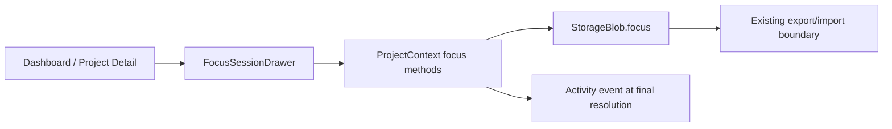

# Project Board v0.11 — Focus Session Specification

Date: 2026-08-03
Status: approved design — ready for implementation planning
Scope: local-first Focus Session persistence, resolution flow, summary surfaces, import/export support, and tests.
Design reference: `docs/superpowers/specs/2026-08-02-project-board-quiet-command-center-design.md`

---

## 1. Objective

Project Board currently records projects well; v0.11 must help its single owner begin and finish **one concrete next action**. Focus Session is a lightweight, local-first timer connected to one project and, optionally, one unfinished step.

### User outcomes

1. From Dashboard or Project Detail, the owner can start a 15, 25, 45, or 60-minute session for a project.
2. The active timer survives reload, browser close/reopen, sleep, and wall-clock passage without drift.
3. On expiry or an intentional stop, the owner explicitly resolves the session: mark its step done, continue working, or add an optional reflection.
4. Completed-session data is visible in Activity, project context, and the weekly review without becoming surveillance or a productivity score.
5. Focus data is included in the existing local JSON backup and safely validated on import.

### Definition of success

The product makes it easier to start a project step today while retaining Project Board's contracts: local-first data, no account, no network, no timer dependency, accessible drawer behavior, and graceful recovery from malformed imported data.

---

## 2. Assumptions and decisions

These are confirmed product decisions, not implementation suggestions:

- UI entry: Dashboard action opens an in-context drawer; mobile uses the same drawer as a full-screen sheet.
- Presets: 15 / 25 / 45 / 60 minutes; 25 is the default.
- A single active session exists globally.
- An active session resumes from absolute timestamps, not from per-second saved ticks.
- Timer completion never automatically completes a step.
- Resolution is explicit: **Mark step done**, **Keep working**, or **Add note**.
- A note is optional and limited to 200 Unicode code units after trimming.
- No audio, browser notification, account, cloud sync, analytics, telemetry, new route, or third-party dependency is introduced.
- `Europe/Berlin` is the Hermes host timezone; browser session records remain ISO-8601 UTC instants, so exports stay portable across devices and timezones.

---

## 3. Commands and technology

Existing stack remains unchanged:

```text
React 19 + TypeScript 6 + React Router 8 + Vite 8
Native browser APIs only: Date, setInterval, localStorage
```

Required commands:

```bash
npm test
npm run lint
npm run build
npm run build:pages
```

No dependency or lockfile modification is permitted for this feature.

---

## 4. Architecture and data model

### 4.1 State placement

`ProjectContext` remains the only mutation boundary for Project Board domain state. Components may manage ephemeral UI state (drawer open/closed, selected preset, unsaved note draft), but they must not write to `localStorage` directly.



### 4.2 Types

`StorageBlob.version` stays `1`. Focus fields are optional so existing v1 backups retain compatibility.

```ts
export type FocusOutcome = 'completed' | 'stopped' | 'expired';

export interface ActiveFocusSession {
  id: string;
  projectId: string;
  stepId?: string;
  startedAt: string;       // Canonical ISO UTC instant
  endsAt: string;          // Canonical ISO UTC instant; authoritative timer boundary
  /** Set by Stop; keeps the session resolvable after refresh/close. */
  stoppedAt?: string;      // Canonical ISO UTC instant, in [startedAt, endsAt]
  plannedMinutes: 15 | 25 | 45 | 60;
}

export interface FocusSessionRecord {
  id: string;
  projectId: string;
  stepId?: string;
  startedAt: string;
  endedAt: string;
  plannedMinutes: 15 | 25 | 45 | 60;
  elapsedSeconds: number;
  outcome: FocusOutcome;
  note?: string;
}

export interface FocusState {
  active: ActiveFocusSession | null;
  history: FocusSessionRecord[];
}

export interface StorageBlob {
  version: 1;
  projects: Project[];
  settings: AppSettings;
  focus?: FocusState;
}
```

`DEFAULT_FOCUS_STATE` is `{ active: null, history: [] }`. Loading a pre-v0.11 blob normalizes the absent field to this default. This is additive migration only: project fields, settings, activity storage key, and existing storage key remain unchanged.

### 4.3 Timer semantics

The UI may tick every second only to redraw. Persistence contains timestamps only:

```ts
remainingSeconds = Math.max(0, Math.ceil((endsAtMs - Date.now()) / 1000));
```

This guarantees no drift after reload or suspension. If `remainingSeconds === 0`, the restored session enters a **ready-to-resolve** state. It is not silently deleted and does not emit an activity event twice.

### 4.4 Invariants

1. `plannedMinutes` is exactly one of 15, 25, 45, 60.
2. At most one `active` session exists.
3. An active session references an existing project; its optional step references an unfinished step on that project. If a linked step is deleted or becomes done through any project mutation, `stepId` is removed from the active session while the session itself remains valid. Its `startedAt`, `endsAt`, and optional `stoppedAt` are canonical ISO UTC instants; `endsAt > startedAt`; if present, `startedAt <= stoppedAt <= endsAt`.
4. Each record references a project that exists in the imported/stored snapshot. An optional `stepId` must belong to that project when present.
5. All historical timestamp fields are canonical ISO UTC instants; `endedAt >= startedAt`. `elapsedSeconds` is derived from the timestamp boundary, rounded down after clamping to `[0, plannedMinutes * 60]`: an `expired` record must end exactly at `startedAt + plannedMinutes * 60_000` and have the full planned seconds; a `stopped` record uses its persisted stop boundary; a `completed` record uses its explicit resolution boundary.
6. `elapsedSeconds` is an integer in `[0, plannedMinutes * 60]` for an expired/completed session and may be shorter for `stopped`.
7. `history` is newest-first and capped at 250 records. New records trim the oldest records only.
8. `note`, if present, is trimmed and 1–200 characters; blank notes are omitted.
9. IDs are generated by existing `createId`; imported duplicate historical record IDs are deterministically deduplicated by `endedAt` descending then `id` ascending before final invariant validation.

---

## 5. User flow and UI behavior

### 5.1 Start

- Dashboard exposes **Start focus** where a project is actionable; Project Detail exposes the same action in its context.
- The opener supplies a selected project. If the project has unfinished steps, the drawer offers an optional step selector; no step is required.
- Preset chooser defaults to 25 minutes.
- Starting persists `active` immediately before the panel shows its running state.
- If another session is active, the application asks for explicit confirmation before stopping it and starting the new session. Cancelling preserves the current session exactly.

### 5.2 Active drawer

The drawer contains:

```text
Project title
Optional selected step
MM:SS, tabular numerals
Planned duration
Stop session
Close panel
```

Closing the drawer, pressing Escape, navigating within the SPA, or refreshing does **not** stop the timer. Escape follows the existing dialog-focus lifecycle and returns focus to the opener.

A live region announces phase changes only (started, restored, complete). It must not announce every second.

### 5.3 Resolve

At expiry or after **Stop session**, the panel enters the resolver state. Stop persists `stoppedAt` immediately but does not create a history record yet, so closing or refreshing cannot restart the timer or lose the pending resolver.

- **Mark step done** — available only for a still-unfinished linked step. It applies the existing step-completion semantics as part of one idempotent domain transition, then finalizes a `completed` record.
- **Keep working** — finalizes the elapsed session first, then starts a new session for the same project/step with a chosen preset. It never overwrites history.
- **Add note** — optional text input; save finalizes the record with the note. The user may also finalize without a note.

`expired` means the timer reached `endsAt`; `stopped` means the owner deliberately stopped it before expiry; `completed` means the linked step was explicitly marked complete through this resolver. Exactly one activity event is added when a record is finalized, never on start, redraw, drawer close, or restoration.

### 5.4 Summary surfaces

- Dashboard shows a compact **Current focus** band only while `focus.active` exists. It names the project, remaining/ready-to-resolve state, and reopens the drawer.
- Project Detail shows a neutral, non-scorekeeping **Focus this week** summary: total completed/stopped/expired elapsed minutes for that project whose `endedAt` falls in the browser's current local week.
- Activity renders the new focus event with a text message and existing timeline semantics.
- Review shows one lightweight aggregate: focus minutes in the current local week. It must not assign grades, streaks, productivity labels, or automated recommendations in v0.11.

All new visual elements use existing Quiet Command Center `--pb-*` tokens: no gradients, glow, glass, raw colors, or new visual language.

---

## 6. Import, export, reset, and deletion behavior

### 6.1 Export

Existing JSON export adds optional `focus` to its v1 storage blob. It includes active and historical focus state so a full backup can restore an in-progress session. Existing exports without `focus` remain valid.

### 6.2 Import validation

Validation is performed before any state mutation. It must reject invalid focus state with the existing plain-language import-error model, including:

- wrong types, unparseable dates, invalid preset/outcome enums;
- out-of-range elapsed time or note length;
- history exceeding 250 entries;
- duplicate focus record IDs after deterministic dedupe is unavailable;
- missing project references or cross-project step references.

Focus validation must retain the existing import size/project/step/link/status/type/theme guards.

### 6.3 Replace and merge

| Import mode | Projects/settings | Focus history | Active session |
|---|---|---|---|
| Replace | Existing behavior | Replaced by validated imported history | Replaced by validated imported active state |
| Merge | Existing behavior | Union by record `id`, sorted newest-first, capped at 250 | Local active session is preserved; imported active is ignored |

Merge records whose project/step does not exist after the existing merge operation are skipped rather than made orphaned. Replace treats an absent optional `focus` as `DEFAULT_FOCUS_STATE`.

### 6.4 Project deletion and full reset

- Deleting a project clears an active session targeting it and removes its focus history. It must not leave orphaned data.
- `resetAll()` resets focus state to `DEFAULT_FOCUS_STATE` with the rest of the local data.
- Seed loading does not create, replace, or fabricate Focus Session records.

---

## 7. Project structure and expected files

Likely implementation files:

```text
src/types.ts                         Focus types and optional StorageBlob field
src/lib/focusSession.ts              Pure duration, status, normalization, validation helpers
src/lib/focusSession.test.ts         Unit tests for time and record invariants
src/lib/storage.ts                   Backward-compatible storage normalization
src/lib/export.ts                    Export focus state and parse hand-off
src/lib/importValidation.ts          Strict focus validation and merge rules
src/lib/importValidation.test.ts     Import and compatibility tests
src/lib/activity.ts                  New activity presentation support only if needed
src/store/ProjectContext.tsx         Focus state, persistence, domain methods, cleanup rules
src/components/FocusSessionDrawer.tsx Drawer and resolution UI
src/components/FocusSessionDrawer.*  Component-level tests only if the existing test stack supports them
src/pages/Dashboard.tsx              Start/current-focus surface
src/pages/ProjectDetail.tsx          Start action and weekly summary
src/pages/Review.tsx                 Weekly aggregate
src/components/RecentActivity.tsx    Focus event rendering if required
src/index.css                        Scoped token-based styles and responsive drawer rules
docs/...                             Spec and later plan only
```

No new route, localStorage key, package dependency, test framework, PWA behavior, shortcut binding, Board keyboard behavior, or unrelated CSS consolidation is in scope.

---

## 8. Code style and boundaries

### Code style

Use existing TypeScript/React conventions: domain helpers are pure, named exports are explicit, context callbacks are the only mutation APIs, and date parsing never trusts an unvalidated input.

```ts
// Pure and deterministic: UI redraw timing cannot change this result.
export function getRemainingSeconds(endsAt: string, nowMs = Date.now()): number {
  const endsAtMs = Date.parse(endsAt);
  if (!Number.isFinite(endsAtMs)) return 0;
  return Math.max(0, Math.ceil((endsAtMs - nowMs) / 1_000));
}
```

### Always

- Validate imported data at the boundary before state mutation.
- Use absolute timestamps for timer recovery.
- Preserve old v1 blobs and exports without focus fields.
- Use `createId`, existing theme tokens, `useDialogFocus`, and existing context mutation patterns.
- Add focused tests before implementation behavior, then run test, lint, build, Pages build, and `git diff --check` before each feature commit.
- Verify 320, 390, 768, 1024, and 1440px browser behavior; test keyboard/focus and reload recovery.

### Ask first

- New dependency, localStorage key, route, notification permission, service worker change, schema version bump, analytics, external sync, or any change to import/export semantics beyond this spec.
- Altering existing keyboard shortcuts, Board behavior, or user data deletion policy.

### Never

- Store per-second timer ticks, browser activity, secrets, or external telemetry.
- Automatically mark a step complete at timer expiry.
- Use raw `localStorage` from a UI component.
- Commit credentials, build artifacts, `node_modules`, or unrelated formatting/refactors.
- Bypass validation, truncate user records silently except the documented 250-record history cap, or claim verification without executing it.

---

## 9. Testing and verification strategy

### Unit tests

1. `getRemainingSeconds` accurately handles running, exact-expiry, past-expiry, malformed timestamps, and injected current time.
2. Active session creation accepts only allowed presets and stores correct absolute timestamps.
3. Restored expired session remains resolvable and does not create duplicate records/activity.
4. Finalization computes bounded elapsed seconds, trims valid notes, and produces exactly one record.
5. History ordering, cap, de-duplication, and project deletion cleanup are deterministic.
6. Import accepts v1 exports without `focus`; accepts valid optional focus; rejects every invalid invariant in §4.4.
7. Replace restores focus snapshot; merge preserves local active state and de-duplicates compatible history.

### Integration/manual browser checks

| Scenario | Expected result |
|---|---|
| Start 15-minute session, reload | Same project/step and accurate remaining time restore |
| Start, close/reopen after expiry | Resolver appears; no record/event until a resolution action |
| Stop early | One `stopped` record with elapsed time; drawer can close safely |
| Mark linked step done | Existing step completion and one focus activity event occur once |
| Keep working | Prior record is final; a new persisted active session begins |
| Delete target project | Current focus is cleared and history is pruned |
| Import old v1 export | Existing project/settings data loads; focus defaults empty |
| Merge backup with active focus | Local active focus remains intact |
| 320 / 390px | Drawer is full-screen, targets >=44px, no page horizontal scroll |
| Keyboard | Focus enters drawer, Tab wraps, Escape closes but preserves session, focus returns |
| Reduced motion | Timer/phase remains legible with no required animation |

### Required final commands

```bash
npm test
npm run lint
npm run build
npm run build:pages
git diff --check
```

A fresh independent review must issue `ship`, `fix-first`, or `rethink` before merge/deploy. Production release is out of scope for this specification and requires a separate explicit approval after implementation evidence.

---

## 10. Acceptance criteria

1. A user can start exactly one persisted focus session from Dashboard or Project Detail with the four documented presets.
2. The timer restores from timestamps accurately after refresh, browser restart, sleep, and expiry; no per-second storage writes occur.
3. An expired/stopped session requires an explicit resolution and never automatically toggles a step.
4. Finalization creates exactly one history record and one activity event; duplicate events are impossible across reload/resolver re-entry.
5. Focus history is optional in v1 data, capped at 250, exportable, importable, and strictly validated.
6. Replace versus merge behavior exactly follows §6.3, including preservation of local active work during merge.
7. Existing projects, settings, activity cap, import guards, routes, shortcuts, Board keyboard/scroll behavior, PWA, and all other v0.10 behavior continue to work.
8. No runtime/development dependency or lockfile changes occur.
9. Drawer behavior satisfies dialog focus handling, mobile >=44px targets, reduced-motion support, and screen-reader phase announcement limits.
10. Tests, lint, standard build, GitHub Pages build, diff check, and browser QA pass with captured evidence before any release request.

---

## 11. Open questions

None. The implementation plan may choose exact component class names and internal callback names, but it must not alter any decision or boundary in this specification.
